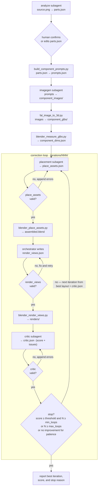

# Dexter — Articulated Asset Agent System

Turn a single product image into an assembled, critiqued 3D asset. The
**orchestrator** OpenCode agent (`.opencode/agents/orchestrator.md`) owns all
control flow. Four OpenCode subagents do the reasoning; tool scripts do the
deterministic work.

## Agentic loop



## Key points

- **Run once, then loop.** Analyze, prompts, images, GLBs, and dimension
  measurement run once. Only placement → assemble → render → critique loops.
- **Orchestrator decides everything.** Subagents write one artifact each and
  exit. No agent-to-agent communication.
- **Resume from disk.** Before each step the orchestrator probes
  `.intermediate/<asset>/<run>/` and skips any step whose output already exists
  and validates, unless you ask to redo it.
- **Human gate.** After `parts.json`, the orchestrator pauses for your review.
  It does not continue until you confirm or edit the parts list.
- **Feedback channel.** On iteration 2+, the placement agent receives the
  previous best `place_assets.json` plus `critic.json` and applies only the
  critic's corrections (skipping `locked` components). If an iteration regresses,
  the next placement is based on the best-scoring layout so far.
- **Schema gates.** `parts`, `place_assets`, `render_views`, and `critic` are
  validated after every write. Invalid output re-invokes the agent with errors
  appended (up to `max_validation_retries`). `render_views.json` is written by
  the orchestrator, not a subagent.
- **Exit rule.** Stop when `score >= score_threshold` and `N >= min_loops`, when
  `N >= max_loops`, or when the score has not improved over the best for
  `no_improvement_patience` consecutive iterations.
- **Models from OpenCode.** No model names or API keys in scripts; subagents use
  your logged-in OpenCode model.

## Layout

```
.intermediate/<asset>/<NNN>/
  source.png  parts.json  prompts.json  component_dims.json  *.json (step configs)
  component_images/  component_glbs/        # generated once
  iterations/NNN/
    place_assets.json  assembled.blend
    render_views.json  renders/  critic.json
```

## Setup

### 1. Install OpenCode

```bash
curl -fsSL https://opencode.ai/install | bash
# or: npm install -g opencode-ai  |  brew install anomalyco/tap/opencode
```

### 2. Connect your model (Codex OAuth)

```bash
opencode          # open the TUI
/connect          # select "opencode", authenticate at opencode.ai/auth, paste your key
```

### 3. Initialise OpenCode for this project

```bash
cd /path/to/dexter
opencode
/init             # analyses the project and writes AGENTS.md
```

### 4. Install Python dependencies

```bash
pip install -r requirements.txt
```

### 5. Set required environment variables

```bash
export FAL_KEY=...          # fal.ai image-to-3D
# blender must be on PATH (or set paths.blender_binary in config.yaml)
```

## Run

Start the orchestrator agent with a natural-language task:

```bash
opencode run --agent orchestrator -- "build the dishwasher from input_images/dishwasher.png"
```

You can also open the OpenCode TUI and chat with the `orchestrator` agent
directly. To resume or iterate on an existing run, point it at the run directory
(e.g. `.intermediate/dishwasher/001/`); it will skip steps whose outputs are
already on disk.

All loop knobs (`min_loops`, `max_loops`, `score_threshold`,
`max_validation_retries`, `no_improvement_patience`), fal settings, and render
defaults live in [`config.yaml`](config.yaml). Subagent definitions and
permissions are in [`opencode.json`](opencode.json) with prompts under
[`.opencode/agents/`](.opencode/agents/). See [`AGENTS.md`](AGENTS.md) for
pipeline semantics and gotchas.
