# Dexter — Articulated Asset Agent System

Turn a single product image into an assembled, critiqued 3D asset. The
**orchestrator** OpenCode agent (`.opencode/agents/orchestrator.md`) owns all
control flow. Five OpenCode subagents do the reasoning; tool scripts do the
deterministic work.

## Agentic loop

```mermaid
flowchart TD
    analyze["analyze subagent\nsource.png → parts.json"] --> gate{"human confirms\nor edits parts.json"}
    gate --> prompts["build_component_prompts.py\nparts.json → prompts.json"]
    prompts --> imagegen["imagegen subagent\nprompts → component_images/"]
    imagegen --> fal["fal_image_to_3d.py\nimages → component_glbs/"]
    fal --> export["blender_export_meshes.py\n→ component_meshes/"]
    export --> simplify["blender_simplify_meshes.py\n→ component_meshes_simp/"]
    simplify --> measure["blender_measure_glbs.py\n→ component_dims.json"]

    measure --> place["placement subagent\n→ assembly.json"]

    subgraph placeLoop ["placement loop  ·  iterations/NNN/"]
        place --> vplace{"assembly\nvalid?"}
        vplace -->|no| place
        vplace -->|yes| assemble["blender_assemble.py\n→ assembled.blend"]
        assemble --> renderplan["render_views.json"]
        renderplan --> render["blender_render_views.py\n→ renders/"]
        render --> critique["critic subagent\n→ critic.json"]
        critique --> decide{"stop placement?\nscore / max / patience"}
        decide -->|no| place
    end

    decide -->|yes best B| pgate{"human confirms\nplacement layout"}
    pgate -->|approve| scene["blender_extract_scene.py\n→ scene.json"]
    pgate -->|more iterations| place
    scene --> pspec["physics_spec subagent\n→ physics_spec.json"]
    pspec --> usd["blender_export_usd.py\n→ robot.usda"]
    usd --> phys["apply_physics_spec.py\n→ robot_physics.usda"]
    phys --> done["report best placement B,\nfinal robot_physics.usda"]
```



## Key points

- **Placement first, physics export last.** Analyze, prompts, images, GLBs, mesh
  export/simplify, and measure run once; then placement → assemble → render →
  critic until layout converges. **After that**, scene extraction →
  `physics_spec` → USD export → `apply_physics_spec.py` produces
  `robot_physics.usda` for Isaac Sim.
- **One IR, two outputs.** `assembly.json` drives Blender renders; the best
  `assembled.blend` plus `physics_spec.json` drives the final physics USD.
- **Orchestrator decides everything.** Subagents write one artifact each and
  exit. No agent-to-agent communication.
- **Resume from disk.** Before each step the orchestrator probes
  `.intermediate/<asset>/<run>/` and skips any step whose output already exists
  and validates, unless you ask to redo it.
- **Human gates.** After `parts.json`, pause for parts review before continuing
  to image generation and placement. After the placement/critic loop, pause again:
  review the best iteration's renders and `assembled.blend`, then confirm or
  request more iterations before physics export. Approval is recorded in
  `placement.confirmed`.
- **Feedback channel.** On iteration 2+, the placement agent receives the
  previous best `assembly.json` plus `critic.json` and applies only the
  critic's corrections (skipping `locked` components). If an iteration regresses,
  the next placement is based on the best-scoring layout so far.
- **Schema gates.** `parts`, `assembly`, `critic`, and `physics_spec` are validated
  after every write. `render_views.json` is written by the orchestrator.
- **Exit rule.** Stop when `score >= score_threshold` and `N >= min_loops`, when
  `N >= max_loops`, or when the score has not improved over the best for
  `no_improvement_patience` consecutive iterations.
- **Models from OpenCode.** No model names or API keys in scripts; subagents use
  your logged-in OpenCode model.

## Layout

```
.intermediate/<asset>/<NNN>/
  source.png  parts.json  prompts.json  component_dims.json
  component_images/  component_glbs/  component_meshes_simp/
  placement.confirmed  scene.json  physics_spec.json  robot.usda  robot_prim_map.json  robot_physics.usda
  iterations/NNN/
    assembly.json  assembled.blend  renders/  critic.json
```

## Physics export assets

After the placement/critic loop picks the best iteration `B`, you review the
layout and confirm it (`placement.confirmed`). Then four steps turn
`iterations/<B>/assembled.blend` into an Isaac Sim-ready asset:

```
assembled.blend → scene.json → physics_spec.json → robot.usda → robot_physics.usda
```

### `iterations/<B>/assembled.blend` — source geometry

The best placement iteration from the critic loop. A Blender scene with the
assembled parts (e.g. `body`, `front_door`, `lower_rack`, `upper_rack`) and
their mesh children. Visual assembly only — no physics yet. Everything
downstream starts from this file.

### `scene.json` — scene summary for the physics agent

Produced by `blender_extract_scene.py`. A compact description of the Blender
scene so the `physics_spec` subagent can reason without opening Blender. For
each object it records:

- **Name and parent tree** — e.g. `front_door` parented under `body`
- **`usd_prim_path`** — where that object will land in USD, e.g.
  `/World/Robot/body/front_door`
- **Transform** — location, rotation, scale
- **Bounding box** — `bbox_min` / `bbox_max` in world space
- **`poly_count`** — aggregate polygon count (drives collision approximation)

No raw vertex data — just enough for mass estimates, joint axes, and prim paths.

### `physics_spec.json` — physics configuration (agent output)

Produced by the `physics_spec` subagent from `scene.json`, `parts.json`, and
`component_dims.json`. A human-readable recipe for Isaac Sim: per-part mass,
friction, collision approximation, joint type/axis/limits, drive
stiffness/damping, and optional collision groups. This is the only
non-deterministic step in the physics export — the agent decides what is
physically plausible for the object category.

To tune behavior (door swing range, rack travel, masses), edit this file and
re-run only the apply step:

```bash
python tool_scripts/apply_physics_spec.py \
  --usd .intermediate/<asset>/<NNN>/robot.usda \
  --spec .intermediate/<asset>/<NNN>/physics_spec.json \
  --output .intermediate/<asset>/<NNN>/robot_physics.usda
```

No need to re-export from Blender unless geometry changed.

### `robot.usda` — geometry-only USD

Produced by `blender_export_usd.py`. Blender geometry exported to USD: all
meshes, materials, and transforms nested under `/World/Robot/...`, with
`upAxis = "Z"` and `metersPerUnit = 1` for Isaac Sim. No physics APIs yet —
just geometry. Can be large when source meshes are high-poly.

### `robot_prim_map.json` — path sanity check

Sidecar from the USD export. Maps Blender object names to the actual USD prim
paths Blender wrote, e.g. `"front_door": "/World/Robot/body/front_door"`.
Useful to confirm `physics_spec.json` prim paths match the exported stage.
`apply_physics_spec.py` warns and falls back to a leaf-name search if a path is
missing.

### `robot_physics.usda` — final Isaac Sim asset

Produced by `apply_physics_spec.py` from `robot.usda` + `physics_spec.json`.
Same geometry as `robot.usda`, plus PhysX schemas:

- **`/World/PhysicsScene`** — gravity direction and magnitude
- **Rigid bodies** — `physics:mass` on each link
- **Collisions** — `PhysicsCollisionAPI` + mesh approximation on each mesh
- **`world_joint`** — `PhysicsFixedJoint` + `ArticulationRootAPI` (pins the
  base to the world)
- **Joints** — `PhysicsRevoluteJoint` / `PhysicsPrismaticJoint` with limits
  and `DriveAPI` (`angular` for revolute, `linear` for prismatic)
- **Collision groups** — optional self-collision filtering between internal parts

**Open this file in Isaac Sim** to simulate the asset.

| File | Role | Open in |
|------|------|---------|
| `assembled.blend` | Best visual assembly | Blender |
| `scene.json` | Scene facts for the agent | Editor / debugging |
| `physics_spec.json` | Physics recipe (editable) | Editor |
| `robot.usda` | Geometry export | USD viewer / Isaac Sim (no sim yet) |
| `robot_prim_map.json` | Name → path lookup | Debugging |
| **`robot_physics.usda`** | **Sim-ready asset** | **Isaac Sim** |

## Setup

### 1. Install OpenCode

```bash
curl -fsSL https://opencode.ai/install | bash
# or: npm install -g opencode-ai  |  brew install anomalyco/tap/opencode
```

### 2. Connect your model (Codex OAuth)

```bash
opencode          # open the TUI
/connect          # select "opencode", authenticate at opencode.ai/auth, paste your key
```

### 3. Initialise OpenCode for this project

```bash
cd /path/to/dexter
opencode
/init             # analyses the project and writes AGENTS.md
```

### 4. Install Python dependencies

```bash
pip install -r requirements.txt
```

### 5. Set required environment variables

```bash
export OPENAI_API_KEY=...   # component PNG generation via openai_imagegen.py (gpt-image-2)
export FAL_KEY=...          # fal.ai image-to-3D (component GLBs)
# blender must be on PATH (or set paths.blender_binary in config.yaml)
# usd-core (in requirements.txt) provides pxr for apply_physics_spec.py
```

## Run

Start the orchestrator agent with a natural-language task:

```bash
opencode run --agent orchestrator -- "build the dishwasher from input_images/dishwasher.png"
```

You can also open the OpenCode TUI and chat with the `orchestrator` agent
directly. To resume or iterate on an existing run, point it at the run directory
(e.g. `.intermediate/dishwasher/001/`); it will skip steps whose outputs are
already on disk.

All loop knobs (`min_loops`, `max_loops`, `score_threshold`,
`max_validation_retries`, `no_improvement_patience`), fal settings, and render
defaults live in [`config.yaml`](config.yaml). Subagent definitions and
permissions are in [`opencode.json`](opencode.json) with prompts under
[`.opencode/agents/`](.opencode/agents/). See [`AGENTS.md`](AGENTS.md) for
pipeline semantics and gotchas.
