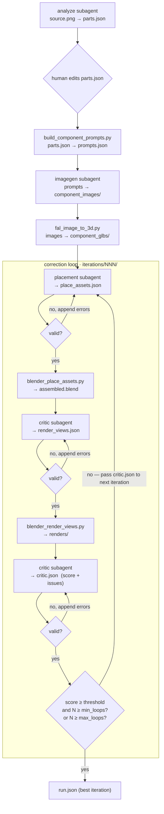

# Dexter — Articulated Asset Agent System

Turn a single product image into an assembled, critiqued 3D asset. A Python
driver (`orchestrator/run_pipeline.py`) owns all control flow. Four OpenCode
subagents do the reasoning; tool scripts do the deterministic work.

## Agentic loop



## Key points

- **Run once, then loop.** Analyze, prompts, images, and 3D run once. Only placement → render → critique loops.
- **Driver decides everything.** Subagents write one artifact each and exit. No agent-to-agent communication.
- **Feedback channel.** The driver hands `critic.json` + the previous `place_assets.json` to the placement agent at the start of each new iteration.
- **Schema gates.** `parts`, `place_assets`, `render_views`, and `critic` are validated after every agent write. Invalid output re-invokes the agent with the errors appended (up to `max_validation_retries`).
- **Exit rule.** Stop when `score >= score_threshold` and `N >= min_loops`, or when `N >= max_loops`. Best iteration recorded in `run.json`.
- **Models from OpenCode.** No model names or API keys in scripts; subagents use your logged-in OpenCode model.

## Layout

```
.intermediate/<asset>/<run>/
  source.png  parts.json  prompts.json  *.json (step configs)
  component_images/  component_glbs/        # generated once
  iterations/NNN/
    place_assets.json  assembled.blend
    render_views.json  renders/  critic.json
  run.json
```

## Setup

### 1. Install OpenCode

```bash
curl -fsSL https://opencode.ai/install | bash
# or: npm install -g opencode-ai  |  brew install anomalyco/tap/opencode
```

### 2. Connect your model (Codex OAuth)

```bash
opencode          # open the TUI
/connect          # select "opencode", authenticate at opencode.ai/auth, paste your key
```

### 3. Initialise OpenCode for this project

```bash
cd /path/to/dexter
opencode
/init             # analyses the project and writes AGENTS.md
```

### 4. Install Python dependencies

```bash
pip install -r requirements.txt
```

### 5. Set required environment variables

```bash
export FAL_KEY=...          # fal.ai image-to-3D
# blender must be on PATH
```

## Run

```bash
python orchestrator/run_pipeline.py --config config.yaml --image input_images/dishwasher.png
```

- `--run 001` reuses an existing run directory.
- `--skip-human-gate` skips the parts review pause.

All loop knobs (`min_loops`, `max_loops`, `score_threshold`, `max_validation_retries`),
fal settings, and render defaults live in [`config.yaml`](config.yaml).
Subagent definitions and permissions are in [`opencode.json`](opencode.json) with
prompts under [`.opencode/agents/`](.opencode/agents/).
