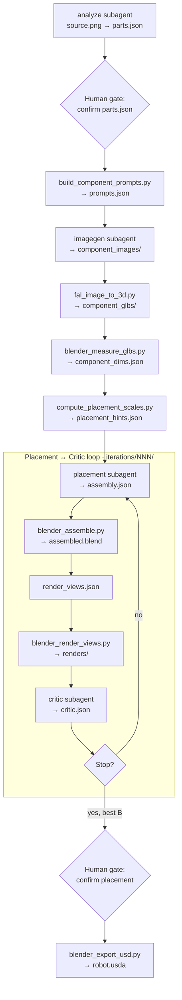

# Dexter — Articulated Asset Agent System

**Dexter** turns a single product photograph into an **articulated 3D asset** — separate part meshes, a kinematic tree, and a USD package loadable in [NVIDIA Isaac Sim](https://developer.nvidia.com/isaac/sim).

An **orchestrator** OpenCode agent drives the pipeline. Four subagents handle reasoning; tool scripts do the deterministic work. Output lands in `.intermediate/<asset>/<NNN>/`; the final deliverable is `robot.usda`.

📖 **[Documentation](docs/README.md)** — requirements, architecture, agents, schemas, sample runs, and developer guide.

Browse locally: `cd docs && npm i && npm run dev` → http://localhost:3000

## Agentic loop



Two human gates pause the run: **parts review** (before 3D generation) and **placement review** (before USD export). The orchestrator resumes from disk and skips steps whose outputs already exist.

See the docs for stage-by-stage detail, agents, IRs, and schemas: [Agentic Loop](docs/pages/architecture/agentic-loop.mdx) · [Architecture](docs/pages/architecture/overview.mdx)

## Quick install

**Requirements:** Python 3.10+, Blender 3.6+, OpenCode, `OPENAI_API_KEY`, `FAL_KEY`. See [Requirements](docs/pages/getting-started/requirements.mdx) for the full checklist.

```bash
# 1. OpenCode
curl -fsSL https://opencode.ai/install | bash
opencode          # then /connect to authenticate

# 2. Python deps
pip install -r requirements.txt

# 3. API keys
export OPENAI_API_KEY=...   # component PNGs (openai_imagegen.py)
export FAL_KEY=...          # image-to-3D GLBs (fal_image_to_3d.py)
# blender must be on PATH (or set paths.blender_binary in config.yaml)

# 4. Initialise project (first time)
cd dexter
opencode
/init             # writes AGENTS.md
```

Full walkthrough: [Installation](docs/pages/getting-started/installation.mdx)

## Run

**CLI** (headless):

```bash
opencode run --agent orchestrator -- "build the dishwasher from input_images/dishwasher.png"
```

**TUI** (interactive): open OpenCode in the repo, press **Tab** to select the **orchestrator** agent, then describe your task.

```bash
opencode
```

Resume or iterate on an existing run:

```bash
opencode run --agent orchestrator -- "resume .intermediate/dishwasher/001/"
```

Pipeline knobs (`min_loops`, `max_loops`, `score_threshold`, fal settings, render defaults) live in [`config.yaml`](config.yaml). Agent definitions are in [`opencode.json`](opencode.json); prompts under [`.opencode/agents/`](.opencode/agents/).

More: [Pipeline Run](docs/pages/getting-started/pipeline-run.mdx) · [Configuration](docs/pages/getting-started/configuration.mdx) · [Troubleshooting](docs/pages/sample-runs/troubleshooting.mdx)

## Documentation

| Section | Topics |
|---------|--------|
| [Getting Started](docs/pages/getting-started/requirements.mdx) | Requirements, installation, configuration, pipeline run |
| [Architecture](docs/pages/architecture/overview.mdx) | Agentic loop, agents, IR, schemas, tool scripts |
| [Troubleshooting](docs/pages/sample-runs/troubleshooting.mdx) | Common failures and recovery |
| [Developer Guide](docs/pages/contributing/overview.mdx) | Project structure, extending the pipeline, local dev |

## Repo layout

```
dexter/
├── .opencode/agents/     # orchestrator + subagent prompts
├── config.yaml           # loop, fal, render, USD settings
├── opencode.json         # agent definitions and permissions
├── schemas/              # JSON Schema for pipeline artifacts
├── tool_scripts/         # Python + Blender pipeline scripts
├── input_images/         # bundled source photos
└── docs/                 # documentation site (Nextra)
```

Pipeline output (gitignored): `.intermediate/<asset>/<NNN>/`
