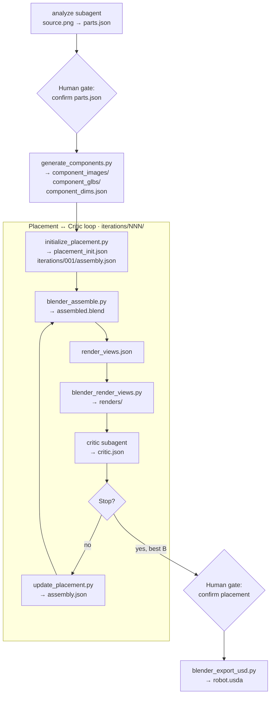

# Dexter — Articulated Asset Agent System

**Dexter** turns a single product photograph into an **articulated 3D asset** — separate part meshes, a kinematic tree, and a USD package loadable in [NVIDIA Isaac Sim](https://developer.nvidia.com/isaac/sim).

An **orchestrator** OpenCode agent drives the pipeline. Two subagents handle reasoning; tool scripts do the deterministic work. Output lands in `.intermediate/<asset>/<NNN>/`; the final deliverable is `robot.usda`.

📖 **[Documentation](docs/README.md)** — requirements, architecture, agents, schemas, sample runs, and developer guide.

Browse locally: `cd docs && npm i && npm run dev` → http://localhost:3000

## Agentic loop



Two human gates pause the run: **parts review** (before 3D generation) and **placement review** (before USD export). The orchestrator resumes from disk and skips steps whose outputs already exist.

See the docs for stage-by-stage detail, agents, IRs, and schemas: [Agentic Loop](docs/pages/architecture/agentic-loop.mdx) · [Sample Run](docs/pages/sample-runs/dishwasher-example.mdx) · [Architecture](docs/pages/architecture/overview.mdx)

## Quick install

**Requirements:** Python 3.10+, Blender 3.6+, OpenCode, `OPENAI_API_KEY`, `FAL_KEY`. See [Requirements](docs/pages/getting-started/requirements.mdx) for the full checklist.

```bash
# 1. OpenCode
curl -fsSL https://opencode.ai/install | bash
opencode          # then /connect to authenticate

# 2. Python deps
pip install -r requirements.txt

# 3. API keys
export OPENAI_API_KEY=...   # component PNGs (generate_components.py)
export FAL_KEY=...          # image-to-3D GLBs (generate_components.py)
# blender must be on PATH (or set paths.blender_binary in configs/base.yaml)

# 4. Initialise project (first time)
cd dexter
opencode
/init             # writes AGENTS.md
```

Full walkthrough: [Installation](docs/pages/getting-started/installation.mdx)

## Run

**CLI** (headless):

```bash
opencode run --agent orchestrator -- "build the dishwasher from input_images/dishwasher.png"
```

**TUI** (interactive): open OpenCode in the repo, press **Tab** to select the **orchestrator** agent, then describe your task.

```bash
opencode
```

Resume or iterate on an existing run:

```bash
opencode run --agent orchestrator -- "resume .intermediate/dishwasher/001/"
```

Pipeline knobs (`min_loops`, `max_loops`, `score_threshold`, fal settings, render defaults) live in [`configs/base.yaml`](configs/base.yaml). Agent definitions are in [`opencode.json`](opencode.json); prompts under [`.opencode/agents/`](.opencode/agents/).

More: [Pipeline Run](docs/pages/getting-started/pipeline-run.mdx) · [Sample Run](docs/pages/sample-runs/dishwasher-example.mdx) · [Configuration](docs/pages/getting-started/configuration.mdx) · [Troubleshooting](docs/pages/sample-runs/troubleshooting.mdx)

## Documentation

| Section | Topics |
|---------|--------|
| [Getting Started](docs/pages/getting-started/requirements.mdx) | Requirements, installation, configuration, pipeline run |
| [Architecture](docs/pages/architecture/overview.mdx) | Agentic loop, agents, IR, schemas, tool scripts |
| [Sample Runs](docs/pages/sample-runs/dishwasher-example.mdx) | End-to-end dishwasher walkthrough |
| [Troubleshooting](docs/pages/sample-runs/troubleshooting.mdx) | Common failures and recovery |
| [Developer Guide](docs/pages/contributing/overview.mdx) | Project structure, extending the pipeline, local dev |

## Repo layout

```
dexter/
├── .opencode/agents/     # orchestrator + subagent prompts
├── configs/
│   └── base.yaml         # loop, fal, render, USD settings
├── opencode.json         # agent definitions and permissions
├── schemas/              # JSON Schema for pipeline artifacts
├── tool_scripts/         # Python + Blender pipeline scripts
├── input_images/         # bundled source photos
└── docs/                 # documentation site (Nextra)
```

Pipeline output (gitignored): `.intermediate/<asset>/<NNN>/`

## Tool script standards

Dexter tool scripts follow [PEP 8](https://peps.python.org/pep-0008/) and are linted with [Ruff](https://docs.astral.sh/ruff/).

### Layout

```
tool_scripts/
  common.py              # shared I/O, config, validation helpers (+ JSON schema CLI)
  <name>.py                # one entrypoint per pipeline step
  blender_<name>.py        # scripts run inside Blender (import bpy)
```

- Put reusable logic in `common.py`; keep entrypoint scripts thin.
- Blender scripts must not import non-Blender dependencies beyond `common.py`.

### Naming

| Kind | Style | Example |
|------|-------|---------|
| Modules | `snake_case` | `initialize_placement.py` |
| Functions | `snake_case`, verb-first | `load_json_file`, `compute_node_scale` |
| Variables | `snake_case`, descriptive | `parent_world_size`, not `pW` |
| Constants | `UPPER_SNAKE_CASE` | `REPO_ROOT`, `DEFAULT_CONFIG_PATH` |
| Private helpers | leading `_` | `_flatten_placements_to_parts` |
| CLI flags | `--kebab-case` | `--run-dir`, `--prev-assembly` |

Avoid abbreviations (`jt`, `hs`, `pi`, `ax_idx`) and Hungarian prefixes. Use full words unless the domain term is standard (`glb`, `usd`, `json`).

### Types and imports

- Start every module with `from __future__ import annotations`.
- Add return types on public functions; use `dict[str, Any]` for JSON blobs.
- Order imports: stdlib → third-party → local (`common`).
- Type-check Blender imports with `# type: ignore[import-not-found]`.

### CLI entrypoints

Every script exposes:

```python
def main() -> None:
    ...

if __name__ == "__main__":
    main()
```

- Use `argparse`; document usage in the module docstring.
- Resolve paths with `Path(...).expanduser().resolve()`.
- Missing inputs: `exit_if_missing()` for CLI tools, or raise `FileNotFoundError` in library code.
- Blender scripts parse argv after `--` via `parse_blender_args()`.

### JSON and config

- Read: `load_json_file(path)`
- Write: `write_json_file(path, data)` (indent 2, trailing newline, UTF-8)
- Config: `load_yaml_config()` from `configs/base.yaml`
- Component dims: `load_dims_map(data)` or `load_dims_file(run_dir)`
- Validation: `validate_json_file()`, `exit_if_invalid_json()`; CLI: `python3 tool_scripts/common.py --schema … --data …`

### User-facing output

Keep stdout minimal and consistent:

| Event | Message |
|-------|---------|
| Artifact written | `Wrote {path}` |
| Skipped existing file | `skip (exists): {path}` |
| Validation pass | `OK: {path}` |
| Validation fail | `INVALID: {path}` + indented errors |
| Recoverable warning | `Warning: …` on stderr |

No progress or debug logging unless explicitly requested.

### Formatting and lint

```bash
ruff check tool_scripts/
ruff format tool_scripts/
```

Configuration lives in `pyproject.toml` at the repo root. Run both commands before committing script changes.
