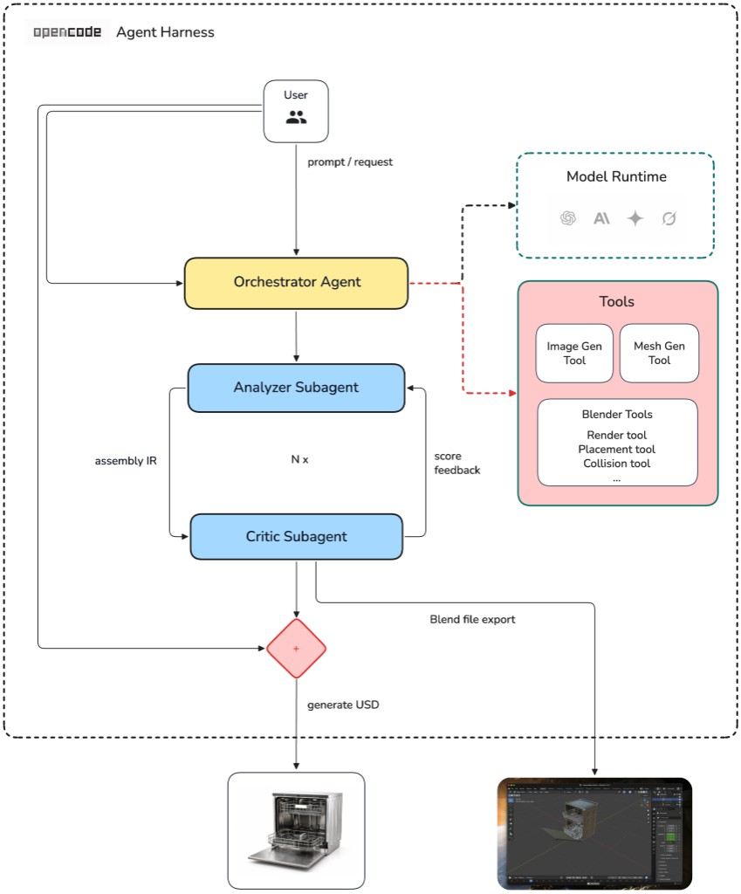

# Dexter — Articulated Asset Agent System

[](https://github.com/aakashvarma/dexter/releases)
[](LICENSE)
[](docs/pages/getting-started/requirements.mdx)
[](docs/README.md)

**Dexter** is an **AI agent** that generates **articulated 3D assets** for **robotic training** in simulators such as [NVIDIA Isaac Sim](https://developer.nvidia.com/isaac/sim). Give it a product photograph of an everyday object and it produces separate part meshes, a kinematic tree, joint definitions, and a USD package you can load and actuate in simulation.

An OpenCode **orchestrator** drives the pipeline. Output lands in `.intermediate/<asset>/<NNN>/`; the final deliverable is `robot.usda`.

| | |
|---|---|
| **[Documentation](docs/README.md)** | Architecture, schemas, sample runs, developer guide |
| **[Blog](https://www.aakashvarma.com/dexter/)** | Motivation, pipeline walkthrough, and example assets |

Browse the docs locally: `cd docs && npm i && npm run dev` → http://localhost:3000



*The orchestrator routes input through **analyze** and **critic** subagents; deterministic tool scripts handle mesh generation, placement, Blender assembly, and USD export.*

## Index

- [Quick start](#quick-start)
- [Sample run: dishwasher](#sample-run-dishwasher)
- [Examples](#examples)
- [What Dexter produces](#what-dexter-produces)
- [Documentation](#documentation)
- [Contributing](#contributing)

---

## Quick start

**Requirements:** Python 3.10+, Blender 3.6+, OpenCode, `OPENAI_API_KEY`, `FAL_KEY`. See [requirements](docs/pages/getting-started/requirements.mdx) for the full checklist.

```bash
# Install OpenCode and authenticate
curl -fsSL https://opencode.ai/install | bash
opencode          # then /connect

# Python deps and API keys
pip install -r requirements.txt
export OPENAI_API_KEY=...   # component PNGs
export FAL_KEY=...          # image-to-3D GLBs
# blender must be on PATH (or set paths.blender_binary in configs/base.yaml)

# First time in repo: opencode, then /init (writes AGENTS.md)

# Run the pipeline
opencode run --agent orchestrator -- "build the dishwasher from input_images/dishwasher.png"
```

Resume or iterate on an existing run:

```bash
opencode run --agent orchestrator -- "resume .intermediate/dishwasher/001/"
```

Interactive TUI: run `opencode`, press **Tab** to select the **orchestrator** agent.

---

## Sample run: dishwasher

The walkthrough below is an example run on a dishwasher product photo. It shows how to use Dexter — what you send in, what the agent produces at each stage, and where you are asked to review before the run continues. Full artifacts from this run (and other examples) are available in the [sample outputs dataset](https://huggingface.co/datasets/varmology/dexter-sample-outputs). See the [dishwasher walkthrough](docs/pages/sample-runs/dishwasher-example.mdx) for iteration-by-iteration detail.

**Step 1 — Start the run.** You provide a reference photo and a prompt in OpenCode:

```bash
opencode run --agent orchestrator -- "build the dishwasher from input_images/dishwasher.png"
```

The orchestrator copies `input_images/dishwasher.png` to `.intermediate/dishwasher/001/source.png` and begins the pipeline. To pick up an existing run later:

```bash
opencode run --agent orchestrator -- "resume .intermediate/dishwasher/001/"
```

**Step 2 — Analyze.** The `analyze` subagent reads your photo and writes `parts.json` — four moving parts (cabinet, front door, upper rack, lower rack) with joint types, sizes, and poses.

<p align="center">
  
</p>

**Step 3 — Parts review (you).** The orchestrator pauses and shows the part list. You confirm that names, joint types, and poses look right — or ask for edits — before any 3D generation runs.

**Step 4 — Components.** After approval, `generate_components.py` produces one isolated PNG, image-to-3D GLB, and mesh dimensions per part. Output: `component_images/`, `component_glbs/`, `component_dims.json`.

<p align="center">
  
</p>

**Step 5 — Placement init.** `initialize_placement.py` combines the part list with mesh measurements and writes the first layout: `iterations/001/assembly.json`.

**Step 6 — Placement loop.** Each round, Blender assembles the meshes (`assembled.blend`), renders four diagnostic views (`renders/`), and the `critic` subagent scores the layout against your photo (`critic.json`). Corrections feed into the next iteration via `update_placement.py`. The loop runs until the score threshold is met, a max round count is reached, or progress stalls. In this run, iteration 1 scored **72** (racks clipping through walls); iteration **6** scored **86** and was selected for export.

<p align="center">
  
  &nbsp;&nbsp;
  
</p>

**Step 7 — Placement review (you).** The orchestrator pauses again. You review renders from the best iteration and the assembled Blender scene, then approve the layout — or ask for another placement round — before export.

**Step 8 — Export.** After approval, `blender_export_usd.py` writes the final deliverable: `robot.usda` and `textures/`, loadable in Isaac Sim. Door and racks animate on their joints in Blender before export.

<p align="center">
  <video src="docs/public/assets/video/dexter/dishwasher_blender_animation.mp4" controls width="640">
    <a href="docs/public/assets/video/dexter/dishwasher_blender_animation.mp4">Download animation video</a>
  </video>
</p>

→ **[Full sample run with iteration details](docs/pages/sample-runs/dishwasher-example.mdx)**

---

## Examples

From one reference photo each, Dexter has produced full articulated assets — per-part GLBs, an assembly layout, and USD export — for these household appliances:

<table>
  <tr>
    <td align="center" width="25%">
      <b>Dishwasher</b><br/>
      <sub>Door and dish racks</sub><br/><br/>
      <div style="width:200px;height:200px;display:inline-flex;align-items:center;justify-content:center;background:#f5f5f5;border-radius:8px;">
        
      </div>
    </td>
    <td align="center" width="25%">
      <b>Refrigerator</b><br/>
      <sub>French doors and freezer drawer</sub><br/><br/>
      <div style="width:200px;height:200px;display:inline-flex;align-items:center;justify-content:center;background:#f5f5f5;border-radius:8px;">
        
      </div>
    </td>
    <td align="center" width="25%">
      <b>Washing machine</b><br/>
      <sub>Front-load door and cabinet</sub><br/><br/>
      <div style="width:200px;height:200px;display:inline-flex;align-items:center;justify-content:center;background:#f5f5f5;border-radius:8px;">
        
      </div>
    </td>
    <td align="center" width="25%">
      <b>Oven</b><br/>
      <sub>Drop-down door and cooktop</sub><br/><br/>
      <div style="width:200px;height:200px;display:inline-flex;align-items:center;justify-content:center;background:#f5f5f5;border-radius:8px;">
        
      </div>
    </td>
  </tr>
</table>

Bundled inputs live in [`input_images/`](input_images/). Run any of them with the [quick start](#quick-start) command above.

**Sample run outputs** — download the real pipeline artifacts (GLBs, JSON IRs, `robot.usda`, etc.) to inspect or verify without running Dexter yourself: [varmology/dexter-sample-outputs on Hugging Face](https://huggingface.co/datasets/varmology/dexter-sample-outputs).

Screen recording of a refrigerator run in OpenCode — source photo through placement to USD export.

<p align="center">
  <video src="docs/public/assets/video/dexter/dexter_demo.mp4" controls width="720">
    <a href="docs/public/assets/video/dexter/dexter_demo.mp4">Download demo video</a>
  </video>
</p>

---

## What Dexter produces

| Deliverable | Description |
|-------------|-------------|
| Per-part meshes | `component_glbs/<part>.glb` — one GLB per moving part |
| Parts IR | `parts.json` — kinematic tree and joint types |
| Layout IR | `assembly.json` — position, orientation, and scale per part |
| Critique IR | `critic.json` — layout score and per-part corrections |
| USD export | `robot.usda` + `textures/` — loadable in Isaac Sim |

Image-to-3D models today output a single fused mesh. Dexter breaks the object into articulated parts with joints you can actuate in simulation.

---

## Documentation

| Topic | Link |
|-------|------|
| Install & run | [Getting Started](docs/pages/getting-started/installation.mdx) |
| How the pipeline works | [Architecture](docs/pages/architecture/overview.mdx) · [Agentic Loop](docs/pages/architecture/agentic-loop.mdx) |
| End-to-end example | [Dishwasher sample run](docs/pages/sample-runs/dishwasher-example.mdx) |
| Troubleshooting | [Common failures](docs/pages/sample-runs/troubleshooting.mdx) |
| Project write-up | [Blog](https://www.aakashvarma.com/dexter/) |

The docs site is the source of truth for setup, schemas, and pipeline behavior.

---

## Contributing

Dexter is built for extension — new subagents, tool scripts, schemas, and placement logic all plug into the OpenCode orchestrator.

| Topic | Link |
|-------|------|
| Developer guide | [Contributing overview](docs/pages/contributing/overview.mdx) |
| Repo layout | [Project structure](docs/pages/contributing/project-structure.mdx) |
| Tool script conventions | [Tool script standards](docs/pages/contributing/tool-script-standards.mdx) |

Pipeline config: [`configs/base.yaml`](configs/base.yaml). Agent definitions: [`opencode.json`](opencode.json), prompts in [`.opencode/agents/`](.opencode/agents/). Agent and orchestrator behavior is also summarized in [`AGENTS.md`](AGENTS.md).

Pull requests and issues welcome. See [CONTRIBUTING.md](CONTRIBUTING.md), [CHANGELOG.md](CHANGELOG.md), and [SECURITY.md](SECURITY.md).
