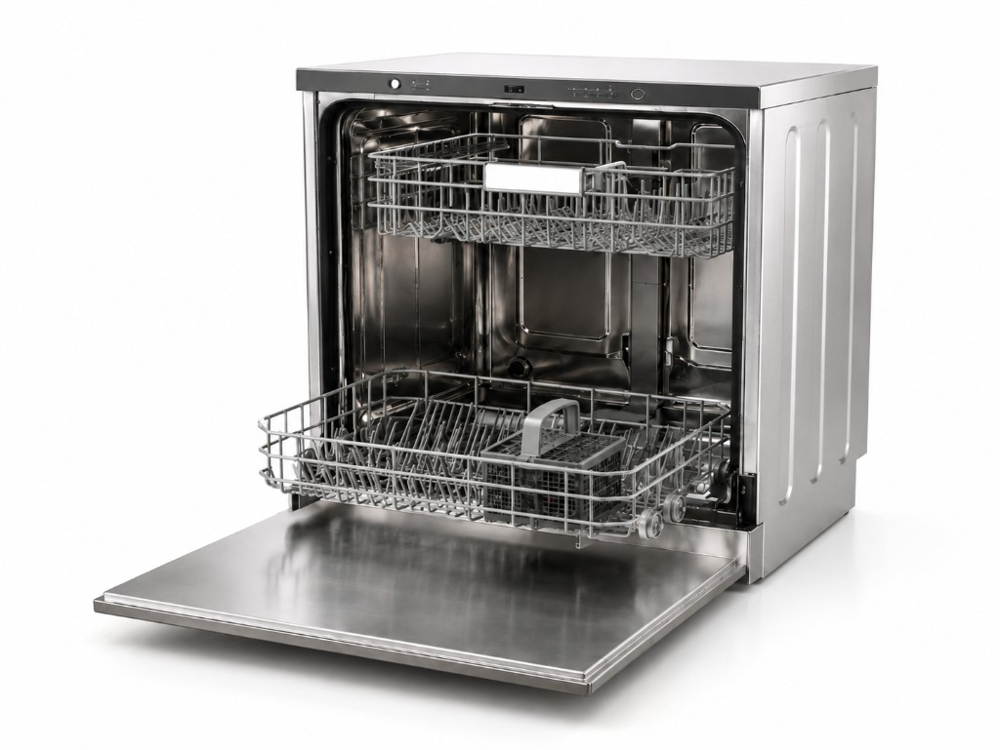
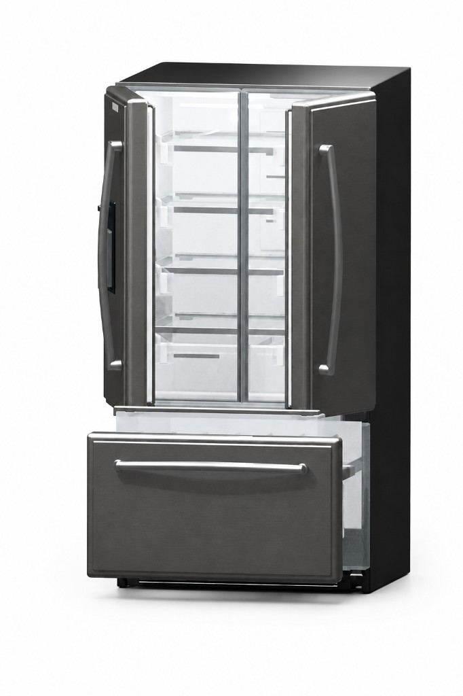
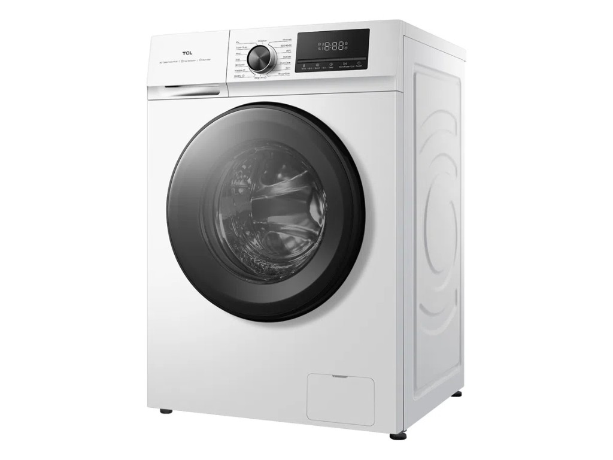
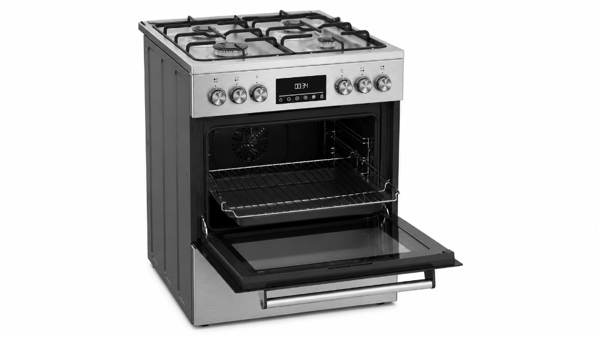
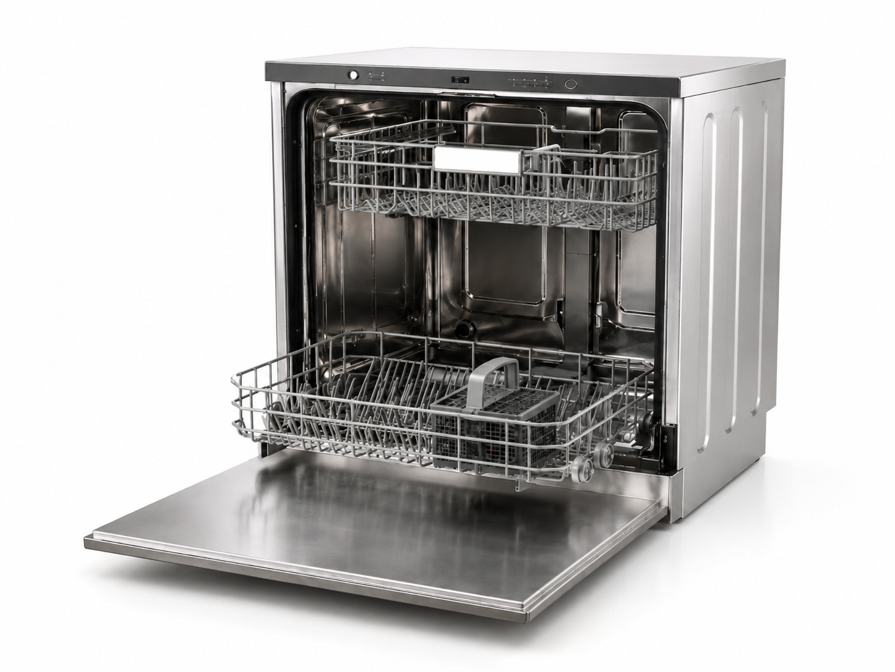
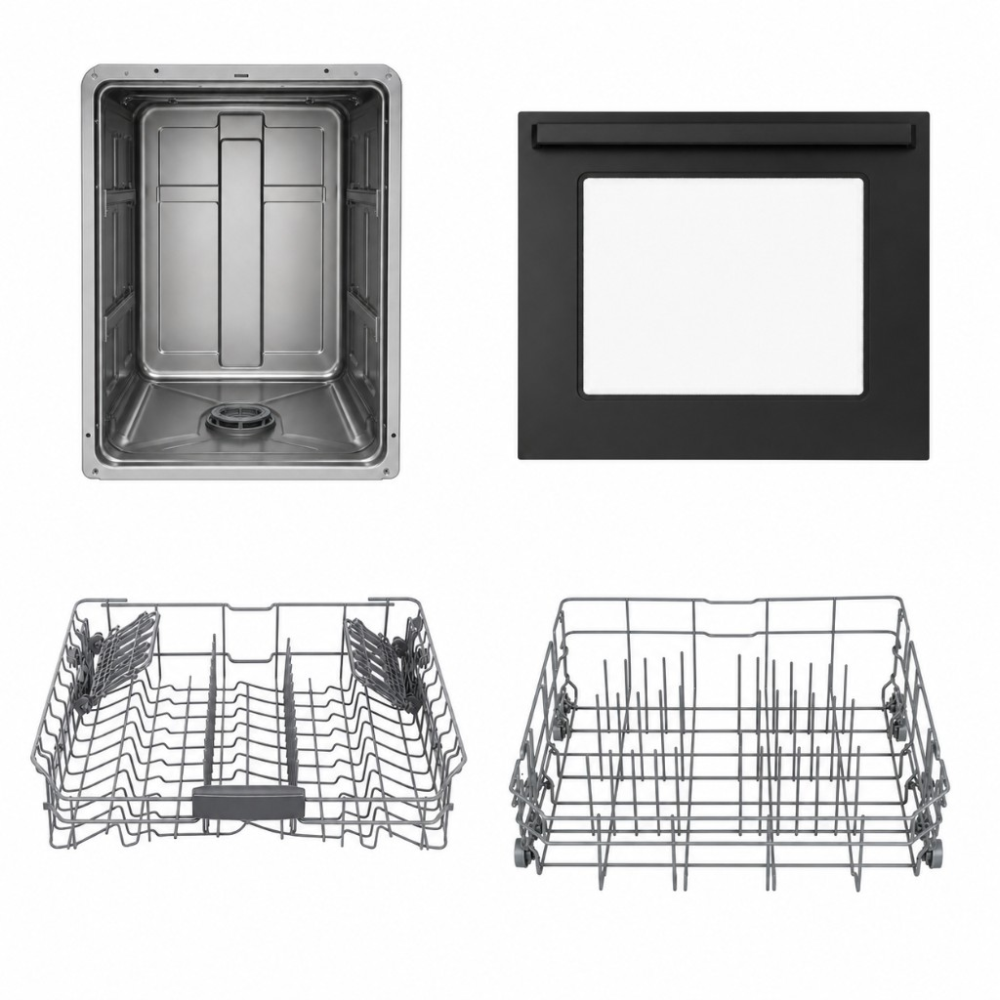
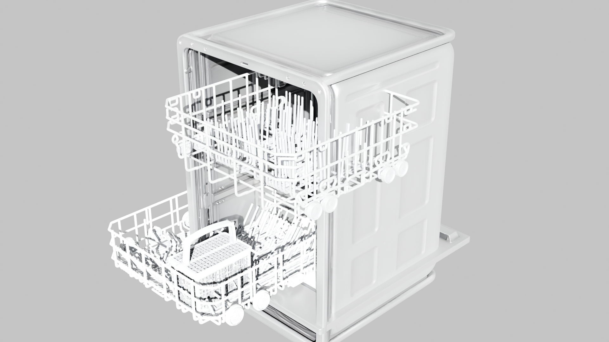
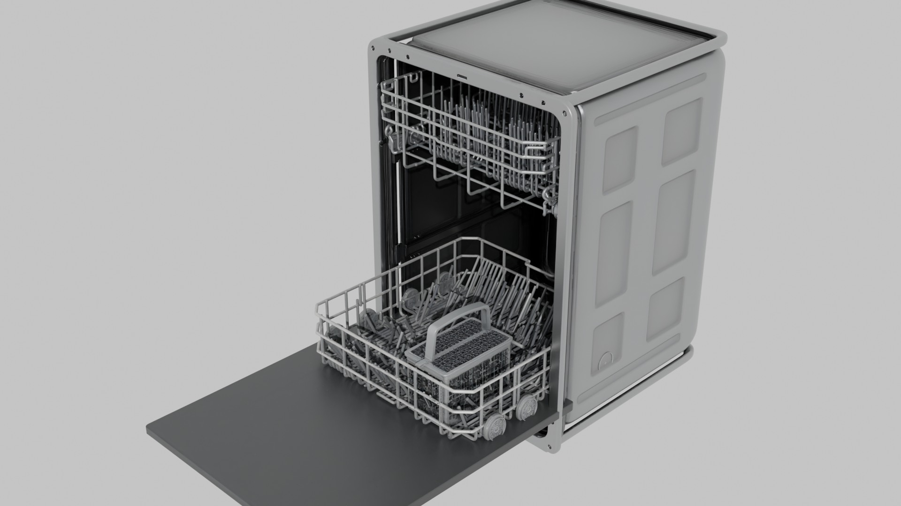

# Dexter — Articulated Asset Agent System

[](https://github.com/aakashvarma/dexter/releases)
[](LICENSE)
[](docs/pages/getting-started/requirements.mdx)
[](docs/README.md)

**Dexter** turns a single product photograph into an **articulated 3D asset** — separate part meshes, a kinematic tree, and a USD package loadable in [NVIDIA Isaac Sim](https://developer.nvidia.com/isaac/sim).

An OpenCode **orchestrator** agent drives the pipeline. Output lands in `.intermediate/<asset>/<NNN>/`; the final deliverable is `robot.usda`.

| | |
|---|---|
| **[Documentation](docs/README.md)** | Architecture, schemas, sample runs, developer guide |
| **Blog** | Detailed write-up coming soon — link will be added here |

Browse the docs locally: `cd docs && npm i && npm run dev` → http://localhost:3000

## Index

- [Examples](#examples)
- [What Dexter produces](#what-dexter-produces)
- [Sample run: dishwasher](#sample-run-dishwasher)
- [Quick start](#quick-start)
- [Documentation](#documentation)
- [Contributing](#contributing)

---

## Examples

From one reference photo each, Dexter has produced full articulated assets — per-part GLBs, an assembly layout, and USD export — for these household appliances:

<table>
  <tr>
    <td align="center" width="50%">
      <b>Dishwasher</b><br/>
      <sub>Door and dish racks as separate moving parts</sub><br/><br/>
      
    </td>
    <td align="center" width="50%">
      <b>Refrigerator</b><br/>
      <sub>French doors and freezer drawer</sub><br/><br/>
      
    </td>
  </tr>
  <tr>
    <td align="center" width="50%">
      <b>Washing machine</b><br/>
      <sub>Front-load door and cabinet</sub><br/><br/>
      
    </td>
    <td align="center" width="50%">
      <b>Oven</b><br/>
      <sub>Drop-down oven door and cooktop</sub><br/><br/>
      
    </td>
  </tr>
</table>

Bundled inputs live in [`input_images/`](input_images/). Run any of them with the [quick start](#quick-start) command below.

**Sample run outputs** — download the real pipeline artifacts (GLBs, JSON IRs, `robot.usda`, etc.) to inspect or verify without running Dexter yourself: [varmology/dexter-sample-outputs on Hugging Face](https://huggingface.co/datasets/varmology/dexter-sample-outputs).

Screen recording of a refrigerator run in OpenCode — source photo through placement to USD export.

<p align="center">
  <video src="docs/public/assets/video/dexter/dexter_demo.mp4" controls width="720">
    <a href="docs/public/assets/video/dexter/dexter_demo.mp4">Download demo video</a>
  </video>
</p>

---

## What Dexter produces

| Deliverable | Description |
|-------------|-------------|
| Per-part meshes | `component_glbs/<part>.glb` — one GLB per moving part |
| Parts IR | `parts.json` — kinematic tree and joint types |
| Layout IR | `assembly.json` — position, orientation, and scale per part |
| Critique IR | `critic.json` — layout score and per-part corrections |
| USD export | `robot.usda` + `textures/` — loadable in Isaac Sim |

Image-to-3D models today output a single fused mesh. Dexter breaks the object into articulated parts with joints you can actuate in simulation.

---

## Sample run: dishwasher

The [dishwasher walkthrough](docs/pages/sample-runs/dishwasher-example.mdx) follows one run end to end — from `input_images/dishwasher.png` to `.intermediate/dishwasher/001/robot.usda`. Matching artifacts are in the [sample outputs dataset](https://huggingface.co/datasets/varmology/dexter-sample-outputs).

**1. Analyze** — The `analyze` subagent reads the photo and writes `parts.json` with four parts: cabinet, front door, upper rack, and lower rack.

<p align="center">
  
</p>

**2. Generate components** — After a human parts review, `generate_components.py` produces isolated PNGs, fal.ai GLBs, and mesh dimensions for each part.

<p align="center">
  
</p>

**3. Placement loop** — Blender assembles the scene, renders four views, and the `critic` subagent scores the layout. Corrections feed back through `update_placement.py` until the loop stops. In the reference run, iteration 1 scored **72** (racks clipping through walls); iteration **6** scored **86** and was selected for export.

<p align="center">
  
  &nbsp;&nbsp;
  
</p>

**4. Export** — After placement approval, `blender_export_usd.py` writes `robot.usda` with packed textures.

→ **[Full sample run with videos and iteration details](docs/pages/sample-runs/dishwasher-example.mdx)**

---

## Quick start

**Requirements:** Python 3.10+, Blender 3.6+, OpenCode, `OPENAI_API_KEY`, `FAL_KEY`. See [requirements](docs/pages/getting-started/requirements.mdx) for the full checklist.

```bash
# Install OpenCode and authenticate
curl -fsSL https://opencode.ai/install | bash
opencode          # then /connect

# Python deps and API keys
pip install -r requirements.txt
export OPENAI_API_KEY=...   # component PNGs
export FAL_KEY=...          # image-to-3D GLBs
# blender must be on PATH (or set paths.blender_binary in configs/base.yaml)

# First time in repo: opencode, then /init (writes AGENTS.md)

# Run the pipeline
opencode run --agent orchestrator -- "build the dishwasher from input_images/dishwasher.png"
```

Resume or iterate on an existing run:

```bash
opencode run --agent orchestrator -- "resume .intermediate/dishwasher/001/"
```

Interactive TUI: run `opencode`, press **Tab** to select the **orchestrator** agent.

---

## Documentation

| Topic | Link |
|-------|------|
| Install & run | [Getting Started](docs/pages/getting-started/installation.mdx) |
| How the pipeline works | [Architecture](docs/pages/architecture/overview.mdx) · [Agentic Loop](docs/pages/architecture/agentic-loop.mdx) |
| End-to-end example | [Dishwasher sample run](docs/pages/sample-runs/dishwasher-example.mdx) |
| Troubleshooting | [Common failures](docs/pages/sample-runs/troubleshooting.mdx) |

For the narrative behind the project, watch for the **blog post** (link coming soon). The docs site is the source of truth for setup, schemas, and pipeline behavior.

---

## Contributing

Dexter is built for extension — new subagents, tool scripts, schemas, and placement logic all plug into the OpenCode orchestrator.

| Topic | Link |
|-------|------|
| Developer guide | [Contributing overview](docs/pages/contributing/overview.mdx) |
| Repo layout | [Project structure](docs/pages/contributing/project-structure.mdx) |
| Tool script conventions | [Tool script standards](docs/pages/contributing/tool-script-standards.mdx) |

Pipeline config: [`configs/base.yaml`](configs/base.yaml). Agent definitions: [`opencode.json`](opencode.json), prompts in [`.opencode/agents/`](.opencode/agents/). Agent and orchestrator behavior is also summarized in [`AGENTS.md`](AGENTS.md).

Pull requests and issues welcome. See [CONTRIBUTING.md](CONTRIBUTING.md), [CHANGELOG.md](CHANGELOG.md), and [SECURITY.md](SECURITY.md).
