# Dexter — Articulated Asset Agent System

Turn a single product image into an assembled, critiqued 3D asset. The
**orchestrator** OpenCode agent (`.opencode/agents/orchestrator.md`) owns all
control flow. Five OpenCode subagents do the reasoning; tool scripts do the
deterministic work.

## Agentic loop

```mermaid
flowchart TD
    analyze["analyze subagent\nsource.png → parts.json"] --> gate{"human confirms\nor edits parts.json"}
    gate --> prompts["build_component_prompts.py\nparts.json → prompts.json"]
    prompts --> imagegen["imagegen subagent\nprompts → component_images/"]
    imagegen --> fal["fal_image_to_3d.py\nimages → component_glbs/"]
    fal --> export["blender_export_meshes.py\n→ component_meshes/"]
    export --> simplify["blender_simplify_meshes.py\n→ component_meshes_simp/"]
    simplify --> measure["blender_measure_glbs.py\n→ component_dims.json"]

    measure --> place["placement subagent\n→ assembly.json"]

    subgraph placeLoop ["placement loop  ·  iterations/NNN/"]
        place --> vplace{"assembly\nvalid?"}
        vplace -->|no| place
        vplace -->|yes| assemble["blender_assemble.py\n→ assembled.blend"]
        assemble --> renderplan["render_views.json"]
        renderplan --> render["blender_render_views.py\n→ renders/"]
        render --> critique["critic subagent\n→ critic.json"]
        critique --> decide{"stop placement?\nscore / max / patience"}
        decide -->|no| place
    end

    decide -->|yes best B| jprops["joint_props subagent\n→ joint_props.json"]
    jprops --> urdf["build_urdf.py\n→ model.urdf"]
    urdf --> jgate{"human reviews URDF\nview_urdf.py sliders"}
    jgate -->|feedback| jprops
    jgate -->|confirm| done["report best placement B,\nfinal model.urdf"]
```



## Key points

- **Placement first, URDF last.** Analyze, prompts, images, GLBs, mesh
  export/simplify, and measure run once; then placement → assemble → render →
  critic until layout converges. **After that**, `joint_props` drafts axes/limits,
  `build_urdf.py` writes `model.urdf`, and you review motion in PyBullet until
  you confirm (feedback re-runs `joint_props` + URDF rebuild).
- **One IR, two outputs.** `assembly.json` drives Blender renders; the same file
  (best iteration) plus final `joint_props.json` drives `model.urdf`.
- **Orchestrator decides everything.** Subagents write one artifact each and
  exit. No agent-to-agent communication.
- **Resume from disk.** Before each step the orchestrator probes
  `.intermediate/<asset>/<run>/` and skips any step whose output already exists
  and validates, unless you ask to redo it.
- **Human gates.** After `parts.json`, pause for parts review. After the first
  `model.urdf`, pause again: use `python tool_scripts/view_urdf.py --urdf …/model.urdf`,
  then confirm or send joint feedback until axes/limits are right.
- **Feedback channel.** On iteration 2+, the placement agent receives the
  previous best `assembly.json` plus `critic.json` and applies only the
  critic's corrections (skipping `locked` components). If an iteration regresses,
  the next placement is based on the best-scoring layout so far.
- **Schema gates.** `parts`, `assembly`, `critic`, and `joint_props` are validated
  after every write. `render_views.json` is written by the orchestrator.
- **Exit rule.** Stop when `score >= score_threshold` and `N >= min_loops`, when
  `N >= max_loops`, or when the score has not improved over the best for
  `no_improvement_patience` consecutive iterations.
- **Models from OpenCode.** No model names or API keys in scripts; subagents use
  your logged-in OpenCode model.

## Layout

```
.intermediate/<asset>/<NNN>/
  source.png  parts.json  joint_props.json  model.urdf  prompts.json  component_dims.json
  component_images/  component_glbs/  component_meshes_simp/
  joint_feedback.log  joint_props.confirmed  # after human joint review
  iterations/NNN/
    assembly.json  assembled.blend  renders/  critic.json
```

## Setup

### 1. Install OpenCode

```bash
curl -fsSL https://opencode.ai/install | bash
# or: npm install -g opencode-ai  |  brew install anomalyco/tap/opencode
```

### 2. Connect your model (Codex OAuth)

```bash
opencode          # open the TUI
/connect          # select "opencode", authenticate at opencode.ai/auth, paste your key
```

### 3. Initialise OpenCode for this project

```bash
cd /path/to/dexter
opencode
/init             # analyses the project and writes AGENTS.md
```

### 4. Install Python dependencies

```bash
pip install -r requirements.txt
```

### 5. Set required environment variables

```bash
export FAL_KEY=...          # fal.ai image-to-3D
# blender must be on PATH (or set paths.blender_binary in config.yaml)
```

## Run

Start the orchestrator agent with a natural-language task:

```bash
opencode run --agent orchestrator -- "build the dishwasher from input_images/dishwasher.png"
```

You can also open the OpenCode TUI and chat with the `orchestrator` agent
directly. To resume or iterate on an existing run, point it at the run directory
(e.g. `.intermediate/dishwasher/001/`); it will skip steps whose outputs are
already on disk.

All loop knobs (`min_loops`, `max_loops`, `score_threshold`,
`max_validation_retries`, `no_improvement_patience`), fal settings, and render
defaults live in [`config.yaml`](config.yaml). Subagent definitions and
permissions are in [`opencode.json`](opencode.json) with prompts under
[`.opencode/agents/`](.opencode/agents/). See [`AGENTS.md`](AGENTS.md) for
pipeline semantics and gotchas.
