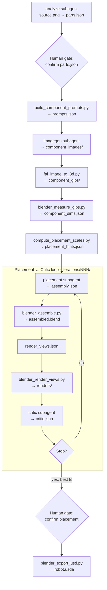

# Agentic Loop

The agentic loop is the core control flow of Dexter. An orchestrator agent sequences subagents and tool scripts, pausing at two human gates, iterating placement until layout converges.

## Full pipeline diagram



## Six pipeline stages

### Stage 1 — Part identification

**Agent:** `analyze` subagent
**Output:** `parts.json` (Parts IR)
**Human gate:** Yes — approve parts before any 3D generation

The analyze agent reads the source image and proposes the minimal set of moving parts with joint types, geometry hints (`size_fraction`, `hinge_side`, `slide_axis`), and descriptions for image generation.

### Stage 2 — Per-part image generation

**Agent:** `imagegen` subagent → `openai_imagegen.py`
**Output:** `component_images/<part>.png`

One isolated, white-background render per part. Uses OpenAI `images.edit()` with `source.png` as visual reference for every call.

### Stage 3 — Mesh generation and measurement

**Scripts:** `fal_image_to_3d.py`, `blender_measure_glbs.py`, `compute_placement_scales.py`
**Output:** `component_glbs/`, `component_dims.json`, `placement_hints.json`

Image-to-3D via fal.ai Hunyuan 3D. Blender measures raw bounding boxes. Placement hints pre-compute correct scales and poses from `parts.json` geometry fields.

### Stage 4–5 — Placement ↔ critic loop

**Agents:** `placement` subagent, `critic` subagent
**Scripts:** `blender_assemble.py`, `blender_render_views.py`
**Output per iteration:** `assembly.json`, `assembled.blend`, `renders/`, `critic.json`

Each round:
1. Placement agent writes positions, orientations, scales into the Layout IR
2. Blender assembles and renders four diagnostic views (front, top, left, isometric)
3. Critic agent scores against the source image and returns structured fixes

**Iteration 1:** Start from `placement_hints.json`, match open/closed pose in source image.
**Iteration 2+:** Apply critic corrections only; skip `locked` components; revert to best layout after regressions.

### Stage 6 — Export

**Script:** `blender_export_usd.py`
**Output:** `robot.usda` + `textures/` + `robot_prim_map.json`
**Human gate:** Placement approval required (`placement.confirmed`)

## Human gates

### Gate 1 — Parts review (before 3D generation)

The orchestrator shows the parts list and **waits** for confirmation. Check:
- All moving parts included with specific names (not `body`, `part_1`)
- Descriptions match the image
- `size_fraction`, `hinge_side`, `slide_axis` are plausible

### Gate 2 — Placement review (before USD export)

Shows best iteration renders, critic score, and `assembled.blend`. Options:
- **Approve** → write `placement.confirmed`, continue to USD export
- **Pick different iteration** → write `placement.confirmed` for that iteration
- **More iterations** → resume loop

## Loop exit conditions

Stop when **any** of:

| Condition | Config key |
|-----------|-----------|
| `score >= score_threshold` and `N >= min_loops` | `loop.score_threshold`, `loop.min_loops` |
| `N >= max_loops` | `loop.max_loops` |
| Score plateaued for N iterations | `loop.no_improvement_patience` |

The orchestrator records the **best-scoring** iteration `B` even if a later iteration regresses.

## Validation gates

After every subagent write:

```bash
python3 tool_scripts/validate_json.py \
  --schema schemas/<name>.schema.json \
  --data <path>
```

On failure: re-invoke the same subagent with errors appended, up to `loop.max_validation_retries` times.

## Resume semantics

The orchestrator **always probes the run directory first**. For each step: if output exists and validates → skip. This means you can interrupt at any point and resume later.

```bash
opencode run --agent orchestrator -- "resume .intermediate/dishwasher/001/"
```

## Why prompt-orchestrated (v0)

Dexter v0 uses the model to determine routing, branching, and exit conditions. This makes it fast to experiment with loop structure before committing to a hardened state machine. A production version would run the same stages as an explicit graph with fixed transitions and typed IRs at each edge — saving tokens, removing routing hallucination, and making the pipeline auditable.

See [Agents](/architecture/agents) for per-agent details.
