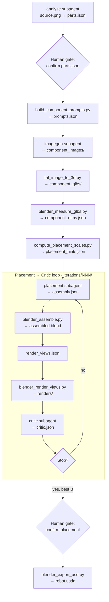

# How Dexter Works

Give Dexter a photo of a product. Within a single OpenCode session, it hands you back a fully articulated 3D asset — meshes, joints, textures, and a USD file ready to drop into NVIDIA Isaac Sim. This page walks through how that actually happens, step by step.

## The big picture

Dexter is built around a single orchestrator agent. You talk to the orchestrator; it runs everything else. It sequences four specialist subagents, calls a set of deterministic Python and Blender scripts, and pauses twice to ask for your sign-off before moving forward. There is no hidden driver script, no separate CLI — just one agent doing the coordination.

Here is the full flow:



The pipeline divides cleanly into six stages. The first three stages happen once. Stages four and five repeat in a loop until the layout looks right. Stage six closes things out with the export.

---

## Stage 1 — Understanding the object

Everything starts with the **analyze** agent reading your source photo.

The analyze agent's job is to break the object down into its meaningful moving parts. For a dishwasher that means identifying the cabinet body, the front door, the upper rack, and the lower rack — not just listing four blobs. For each part it records a name, a short description, what it connects to, and what kind of joint holds them together. A door that swings open is a revolute joint. A rack that slides in and out is prismatic. It also estimates how big each part is relative to its parent and which side the hinge is on.

This output — saved as `parts.json` — is the skeleton the rest of the pipeline builds on. Descriptions from it become image generation prompts. Joint types and geometry hints feed into placement later. If this file is wrong, everything downstream will be wrong too.

That's why the orchestrator **stops here and asks you to review it** before spending any API credits on 3D generation. It is the cheapest point to catch errors.

---

## Stage 2 — Generating component images

Once you confirm the parts list, the pipeline generates a clean isolated image for every component.

A script called `build_component_prompts.py` turns each part's description into an image prompt, asking for that component alone on a white background. Then the **imagegen** agent calls OpenAI's image editing API once per part. Every call uses your original source photo as reference, so the generated images keep the same visual style and proportions. The results land in `component_images/` — one PNG per part.

If you re-run this stage later, any PNG that already exists is skipped. Only missing parts get regenerated.

---

## Stage 3 — Building and measuring the meshes

With component images in hand, the pipeline converts each one into a 3D mesh.

`fal_image_to_3d.py` sends each PNG to fal.ai, which runs Hunyuan 3D and returns a `.glb` file for every part. These meshes are not perfectly accurate — they are rough 3D reconstructions from a single image — but they are good enough for layout and rendering.

After the meshes arrive, Blender measures them. `blender_measure_glbs.py` opens each GLB and records its raw bounding box: exact width, depth, and height before any scaling. These numbers matter because mesh sizes from different 3D generation runs can vary wildly. Without measuring first, the placement agent would be guessing at dimensions.

Finally, `compute_placement_scales.py` combines the measured sizes with geometry hints from `parts.json` to produce `placement_hints.json`. You tell the orchestrator the real-world size of the root part — for example, "this dishwasher cabinet is 60 cm wide, 60 cm deep, and 85 cm tall" — and the script computes the right scale factors for every part in the tree. The first placement iteration uses these hints directly, rather than starting from scratch.

---

## Stage 4 — Laying out the parts

Now the **placement** agent does the spatial reasoning.

It reads the source image, `parts.json`, the measured dimensions, and the pre-computed hints. It then writes `assembly.json` — a layout file describing exactly where each mesh sits in 3D space. Every part gets a position and rotation relative to its parent, and a scale factor that accounts for the full parent-child chain.

The first iteration uses `placement_hints.json` as a starting point and tries to match the pose in your photo. If the dishwasher door is open in the source image, placement opens it. If the racks are partially pulled out, placement pulls them out by a similar amount.

Once the layout file is written, `blender_assemble.py` loads all the meshes and builds a complete Blender scene from it, saved as `assembled.blend`. The orchestrator simultaneously writes `render_views.json`, defining four camera positions for the next stage.

---

## Stage 5 — Rendering and refining

This stage is where the loop actually happens.

`blender_render_views.py` loads the assembled scene and renders four diagnostic images: front, top, left, and isometric. These are not beautiful renders — they are quick lit shots for inspection.

The **critic** agent then looks at all four views alongside the original source photo and gives honest feedback. It writes a score from 0 to 100 and a note for every part. If a rack is sticking out through the side wall, the critic flags it. If the door angle is slightly off, the critic suggests a rotation delta. Parts that look correct get marked `locked`, which means placement will not touch them in the next round.

If the score is not good enough, the loop goes back to placement. But this time placement only applies the critic's specific fixes — it does not start over. Locked parts stay where they are. If a round accidentally makes things worse, placement falls back to the best-scoring layout from any earlier round. The orchestrator always tracks that best iteration.

The loop keeps going until one of three things happens: the score crosses the threshold you set in `config.yaml`, the maximum number of iterations is reached, or the score stops improving for several rounds in a row.

When the loop ends, the orchestrator stops again and shows you the results. You can approve the best layout, pick a different iteration, or ask for more rounds.

---

## Stage 6 — Exporting the final asset

After you write `placement.confirmed`, the pipeline does its final step.

`blender_export_usd.py` opens the approved `assembled.blend` and exports `robot.usda` — a Universal Scene Description file in Z-up coordinates with everything in metres. Material textures get extracted alongside it in a `textures/` folder so Isaac Sim can resolve them. A `robot_prim_map.json` file maps every Blender object name to its USD prim path, which is useful for debugging or scripting further downstream.

---

## A few things worth knowing

**The orchestrator never forgets.** Before every step it checks whether the output already exists and validates. If it does, that step is skipped. This means you can interrupt a run at any point and pick up where you left off:

```bash
opencode run --agent orchestrator -- "resume .intermediate/dishwasher/001/"
```

**Every subagent output is validated.** JSON files from analyze, placement, and critic are all checked against JSON Schemas before the next step begins. If something is malformed, the orchestrator asks the same subagent to try again, up to a configurable limit.

**Subagents never talk to each other.** The orchestrator is the only one with the full picture. It decides what to pass to each subagent, when to move forward, and when to stop. This makes the pipeline easy to debug — you can always trace what went wrong by reading the files in `.intermediate/`.

---

For a detailed look at each agent, see [Agents](/architecture/agents). For every tool script, see [Tool Scripts](/architecture/tools). For a real run with actual outputs, see [Pipeline Run](/getting-started/pipeline-run).
