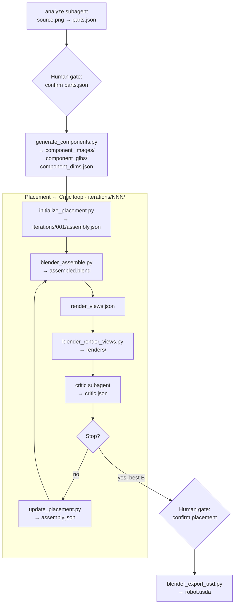

import { Callout } from 'nextra/components'

# Agentic Loop

How Dexter turns a product photo into an articulated USD asset: pipeline flow, agents, intermediate representations (IRs), and tool scripts.

For a concrete walkthrough with example files, see [Sample Run: Dishwasher](/sample-runs/dishwasher-example). For how to start or resume, see [Installation & Run](/getting-started/installation).



---

## Pipeline flow

### Part identification

The **analyze** subagent reads `source.png` and writes `parts.json`: part names, descriptions, parent names, joint types, and numeric placement (`world_size`, `world_center`, `euler_deg`). The orchestrator pauses for your review before any 3D API calls.

### Component generation

`generate_components.py` runs once after parts approval. It produces isolated PNGs (OpenAI), GLBs (fal.ai), and raw mesh measurements (`component_dims.json`). Existing outputs are skipped on re-run.

### Initial placement

`initialize_placement.py` reads world-space poses from `parts.json` and raw mesh sizes from `component_dims.json`, computes Blender `node_scale` and `node_origin`, and writes `iterations/001/assembly.json`. Fully deterministic. No LLM.

### Render, critique, refine

Each iteration:

1. `blender_assemble.py` → `assembled.blend`
2. Orchestrator writes `render_views.json`
3. `blender_render_views.py` → four views (front, top, left, isometric)
4. **critic** subagent → `critic.json`

If the loop continues, `update_placement.py` applies critic corrections to the next `assembly.json` and recomputes `node_scale` / `node_origin`. `locked` parts are unchanged. After a regression, the orchestrator can base the next iteration on the best-scoring layout.

### USD export

After you approve a layout, `blender_export_usd.py` exports `robot.usda`, `textures/`, and `robot_prim_map.json`.

<Callout type="info">
**Human gates**

| Gate | When | What you review |
|------|------|-----------------|
| **Parts** | After `parts.json` | Names, descriptions, joint types, sizes and poses |
| **Placement** | After the critic loop | Best iteration renders, critic score, `assembled.blend` |

Placement iterations are **append-only**: never delete `iterations/` or redo analyze/components to tweak layout. Request changes through a new critic iteration instead.
</Callout>

<Callout type="info">
**Loop exit** (`loop` in `configs/base.yaml`)

Stop when **any** of:

1. `score >= score_threshold` and N ≥ `min_loops`
2. N ≥ `max_loops`
3. Score has not improved for `no_improvement_patience` consecutive iterations

The orchestrator keeps the **best-scoring** iteration even if a later one regresses.
</Callout>

---

## Agents

Three OpenCode agents. Prompt files: `.opencode/agents/`. Permissions: `opencode.json`.

### Orchestrator

You talk to the orchestrator only. It coordinates; it does not do creative analysis itself.

| | |
|---|---|
| **Reads** | `configs/base.yaml`, run directory artifacts |
| **Writes** | `render_views.json` per iteration; `source.png` copy at run start |
| **Invokes** | analyze and critic subagents; all tool scripts |

Before every step it lists `.intermediate/<asset>/<NNN>/` and skips outputs that already exist and validate.

### analyze subagent

| | |
|---|---|
| **Input** | `source.png` |
| **Output** | `parts.json` |
| **Validates** | `schemas/parts.schema.json` |

Looks at the source image and describes the object as a kinematic tree. Each part gets a specific name (e.g. `front_door`, not `part_1`), a short description for image generation, parent name, joint type, and numeric placement.

```json
{
  "name": "front_door",
  "description": "The front drop-down door panel with handle on the upper edge.",
  "parent": "cabinet_body",
  "joint_type": "revolute",
  "world_size": [0.60, 0.04, 0.51],
  "world_center": [0, -0.28, 0.255],
  "euler_deg": [0, 0, 0]
}
```

### critic subagent

| | |
|---|---|
| **Input** | `source.png`, four renders, `assembly.json` |
| **Output** | `critic.json` |
| **Validates** | `schemas/critic.schema.json` |

Compares rendered views to the source photo. For each part it judges scale, position, and orientation independently. Corrections use `corrected_world_size`, `corrected_world_center`, or `suggested_rotation_delta`. Parts are `locked` only when all three are correct.

| Score | Meaning |
|-------|---------|
| 90-100 | All parts correct; no collisions; cosmetic issues only |
| 75-89 | Recognisable; one or two clear problems |
| 60-74 | Several issues, but roughly the right shape |
| below 60 | Fundamentally wrong, floating parts, wrong scale, severe collisions |

<Callout type="warning">
**Permissions**: Every agent writes only inside `.intermediate/`. Subagents can run `common.py` for validation only. They cannot browse the web, call arbitrary scripts, or touch files outside the run directory. No model names or API keys appear in agent prompts.
</Callout>

---

## Intermediate representation

Dexter passes data between agents and tools through typed **IRs**: JSON artifacts with defined schemas. Each IR is produced by one agent or script and consumed by the next step.

| IR | File | Producer | Consumer |
|----|------|----------|----------|
| **Parts** | `parts.json` | analyze subagent | generate_components, initialize_placement |
| **Layout** | `assembly.json` | initialize_placement / update_placement | blender_assemble, USD export |
| **Critique** | `critic.json` | critic subagent | update_placement, orchestrator |
| **Component dims** | `component_dims.json` | generate_components → blender_measure_glbs | initialize_placement, update_placement |
| **Render views** | `render_views.json` | orchestrator | blender_render_views |

### Parts IR (`parts.json`)

```json
{
  "object": "dishwasher",
  "parts": [
    {
      "name": "cabinet_body",
      "description": "The main dishwasher cabinet with insulated walls.",
      "parent": null,
      "joint_type": "fixed",
      "world_size": [0.60, 0.60, 0.85],
      "world_center": [0, 0, 0.425],
      "euler_deg": [0, 0, 0]
    },
    {
      "name": "front_door",
      "description": "The front drop-down door panel.",
      "parent": "cabinet_body",
      "joint_type": "revolute",
      "world_size": [0.60, 0.04, 0.51],
      "world_center": [0, -0.28, 0.255],
      "euler_deg": [0, 0, 0]
    }
  ]
}
```

- `name` → file stem for PNGs, GLBs, and assembly entries
- `description` → copied into image generation prompts
- `world_size`, `world_center`, `euler_deg` on every part (including root) → world-space pose in metres
- Copied into the first `assembly.json`; `node_scale` / `node_origin` are derived from `component_dims.json`

### Layout IR (`assembly.json`)

World-space position, orientation, and size per part in metres. Iteration 001 from `initialize_placement.py`; later iterations from `update_placement.py`.

```json
{
  "root": ".intermediate/dishwasher/001",
  "robot_name": "dishwasher",
  "parts": [
    {
      "name": "cabinet_body",
      "parent": null,
      "visual_mesh": "component_glbs/cabinet_body.glb",
      "collision_mesh": "component_glbs/cabinet_body.glb",
      "world_size": [0.600, 0.522, 0.876],
      "world_center": [0.0, 0.0, 0.438],
      "euler_deg": [0.0, 0.0, 0.0],
      "node_scale": [1.706, 1.761, 1.785],
      "node_origin": [-0.001, -0.025, 0.0]
    }
  ]
}
```

`initialize_placement.py` and `update_placement.py` compute `node_scale` and `node_origin` from `world_*` fields plus `component_dims.json`. `blender_assemble.py` applies those transforms directly.

### Critique IR (`critic.json`)

```json
{
  "iteration": 2,
  "score": 78,
  "pass": false,
  "summary": "Door angle too shallow; racks are laterally offset.",
  "issues": [
    {
      "part": "front_door",
      "problem": "Open angle ~20° but source shows ~45°.",
      "suggested_rotation_delta": [-25.0, 0.0, 0.0]
    },
    {
      "part": "cabinet_body",
      "locked": true,
      "problem": "Correct size, position, and orientation."
    }
  ]
}
```

`update_placement.py` applies corrections **directly** to `assembly.json`:

| Field | Action |
|-------|--------|
| `corrected_world_size` | Replaces `world_size` |
| `corrected_world_center` | Replaces `world_center` |
| `suggested_rotation_delta` | Added to `euler_deg` element-wise |
| `locked: true` | Part unchanged |
| No entry | Part unchanged |

After applying world-space corrections, `update_placement.py` recomputes `node_scale` and `node_origin` for all parts.

### Supporting artifacts

**`component_dims.json`**: raw GLB bounding boxes before scale. Never compare raw dims to the source image; always derive world size via the assembly IR.

If iteration 001 looks wrong, fix `parts.json` and delete `iterations/001/assembly.json`, then rerun `initialize_placement.py`.

### Data flow

```
source.png
  → parts.json
  → component_images/ + component_glbs/ + component_dims.json
  → iterations/001/assembly.json
  → assembled.blend → renders/ → critic.json
  → iterations/NNN/assembly.json  (loop)
  → robot.usda
```

---

## Tool scripts

Deterministic Python and Blender scripts handle everything that does not need LLM judgment. The orchestrator runs them via bash. API keys come from environment variables, never from config files.

| Script | Input → Output |
|--------|----------------|
| `generate_components.py` | `parts.json` + `source.png` → PNGs, GLBs, `component_dims.json` |
| `initialize_placement.py` | `parts.json` + `component_dims.json` → `iterations/001/assembly.json` |
| `update_placement.py` | `assembly.json` + `critic.json` → next `assembly.json` |
| `blender_assemble.py` | `assembly.json` → `assembled.blend` |
| `blender_render_views.py` | `assembled.blend` + `render_views.json` → `renders/*.png` |
| `blender_export_usd.py` | `assembled.blend` → `robot.usda`, `robot_prim_map.json`, `textures/` |
| `blender_measure_glbs.py` | `component_glbs/` → `component_dims.json` (called by `generate_components.py`) |
| `common.py` | shared helpers; `--schema` + `--data` → pass or fail |

<Callout type="info">
**`generate_components.py`**: For each part: OpenAI image edit with `source.png` as reference → fal.ai GLB → `blender_measure_glbs.py` for dims. Skips existing outputs; skips entirely if `component_dims.json` exists.

```bash
python3 tool_scripts/generate_components.py --run-dir .intermediate/dishwasher/001
```
</Callout>

<Callout type="info">
**`initialize_placement.py`**: Combines `parts.json` poses with raw mesh sizes to compute Blender `node_scale` and `node_origin`, then writes `iterations/001/assembly.json`. Validates inputs and output against their schemas.

```bash
python3 tool_scripts/initialize_placement.py --run-dir .intermediate/dishwasher/001
```
</Callout>

<Callout type="info">
**`update_placement.py`**: Applies critic corrections to world-space fields, recomputes `node_scale` / `node_origin`, and validates against `assembly.schema.json`. After a regression, pass the best-scoring layout as `--prev-assembly`.

```bash
python3 tool_scripts/update_placement.py \
  --prev-assembly iterations/001/assembly.json \
  --critic        iterations/001/critic.json \
  --output        iterations/002/assembly.json
```
</Callout>

<Callout type="info">
**Blender scripts**: Arguments must come after `--`:

```bash
blender --background --python tool_scripts/blender_assemble.py -- \
  --layout iterations/001/assembly.json \
  --output iterations/001/assembled.blend
```

`blender_render_views.py` renders one PNG per camera entry. `blender_export_usd.py` exports Z-up USD with textures extracted to `textures/`. Override the binary via `paths.blender_binary` in `configs/base.yaml` if needed.
</Callout>

---

## Schema validation

Every pipeline artifact validates against a JSON Schema in `schemas/`. This prevents bad data from propagating downstream.

```bash
python3 tool_scripts/common.py \
  --schema schemas/<name>.schema.json \
  --data <path/to/artifact.json>
```

Prints `OK` on success; on failure prints each error and a fix hint (`Fix the file to match schemas/...`), then exits 1. Subagents validate their own output; pipeline scripts validate inputs at startup via the same helper (`validate_schema` in `common.py`). When validation fails, the orchestrator re-invokes the same subagent up to `loop.max_validation_retries` (default: 2).

| Schema | Artifact | Written by |
|--------|----------|-----------|
| `parts.schema.json` | `parts.json` | analyze subagent |
| `assembly.schema.json` | `assembly.json` | initialize_placement / update_placement |
| `critic.schema.json` | `critic.json` | critic subagent |
| `render_views.schema.json` | `render_views.json` | orchestrator |
| `component_dims.schema.json` | `component_dims.json` | blender_measure_glbs |

<Callout type="info">
**`render_views.schema.json`**: Per camera: `name`, `direction`, `output`, `light_energy`, `light_type`. Optional `margin` (default 1.3). **Do not add `location` or `look_at`**: the render script auto-frames from `direction`.
</Callout>

<Callout type="info">
**Validate a full run**

```bash
RUN=.intermediate/dishwasher/001

python3 tool_scripts/common.py --schema schemas/parts.schema.json --data $RUN/parts.json

for iter in $RUN/iterations/*/; do
  python3 tool_scripts/common.py --schema schemas/assembly.schema.json --data $iter/assembly.json
  python3 tool_scripts/common.py --schema schemas/critic.schema.json --data $iter/critic.json
done
```
</Callout>

Adding a new schema: see [Schemas & Validation](/contributing/schemas-and-validation) in the Developer Guide.
