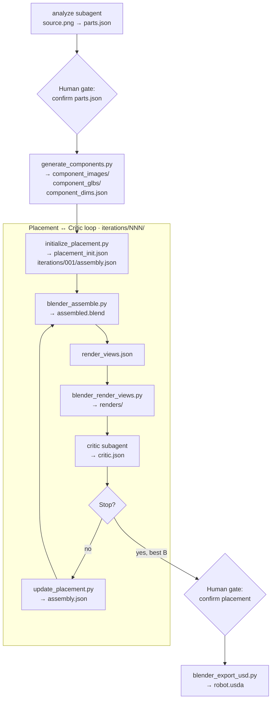

# Agentic Loop

Dexter turns a product photo into an articulated USD asset through one orchestrator agent, two subagents, and deterministic tool scripts. Two human gates pause the run before expensive 3D work and before final export.

For a concrete walkthrough with example files, see [Sample Run: Dishwasher](/sample-runs/dishwasher-example). For how to start or resume, see [Pipeline Run](/getting-started/pipeline-run).



## Stage 1 — Part identification

The **analyze** subagent reads `source.png` and writes `parts.json`: part names, descriptions, parent part names, joint types, and numeric placement (`world_size`, `world_center`, `euler_deg`). The orchestrator pauses for your review before any 3D API calls.

## Stage 2 — Component generation

`generate_components.py` runs once after parts approval. It produces isolated PNGs (OpenAI), GLBs (fal.ai), and raw mesh measurements (`component_dims.json`). Existing outputs are skipped on re-run.

## Stage 3 — Initial placement

`initialize_placement.py` reads world-space poses from `parts.json` and raw mesh sizes from `component_dims.json` to write `placement_init.json` and `iterations/001/assembly.json`. No LLM — scale/origin math is fully deterministic.

## Stage 4 — Render, critique, refine

Each iteration:

1. `blender_assemble.py` builds `assembled.blend` from `assembly.json`
2. The orchestrator writes `render_views.json`
3. `blender_render_views.py` renders four views (front, top, left, isometric)
4. The **critic** subagent scores the result and writes `critic.json`

If the loop continues, `update_placement.py` applies critic corrections directly to world-space values in the next `assembly.json`. `locked` components are left unchanged. After a regression, the orchestrator can base the next iteration on the best-scoring layout instead of the most recent one.

The loop stops when `configs/base.yaml` exit conditions are met. The orchestrator then pauses for placement review.

## Stage 5 — USD export

After you approve a layout, `blender_export_usd.py` exports `robot.usda`, `textures/`, and `robot_prim_map.json`.

## Resuming interrupted runs

```bash
opencode run --agent orchestrator -- "resume .intermediate/dishwasher/001/"
```

The orchestrator checks disk before every step and skips outputs that already exist and validate.

---

See [Agents](/architecture/agents) and [Tool Scripts](/architecture/tools) for per-step inputs and outputs.
