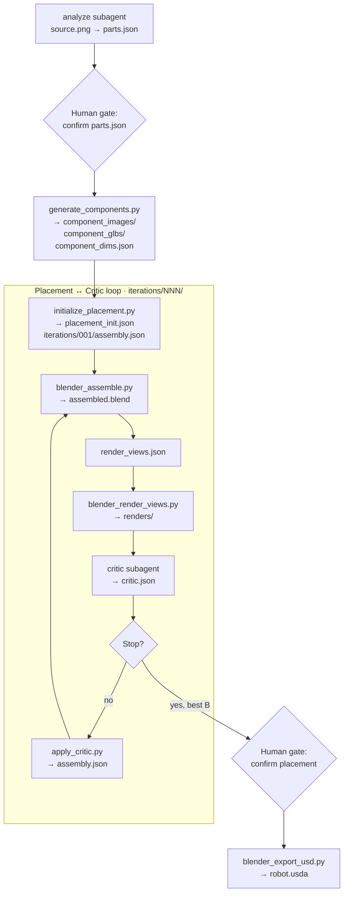

# How Dexter Works

Give Dexter a photo of a product. Within a single OpenCode session, it hands you back a fully articulated 3D asset — meshes, joints, textures, and a USD file ready to drop into NVIDIA Isaac Sim. This page walks through how that actually happens, step by step.

## The big picture

Dexter is built around a single orchestrator agent. You talk to the orchestrator agent; it runs everything else. It sequences two specialist subagents, calls deterministic Python and Blender scripts, and pauses twice to ask for your sign-off before moving forward.



---

## Stage 1 — Understanding the object

The **analyze subagent** reads your source photo and writes `parts.json` — names, descriptions, parent links, joint types, and geometry hints. The orchestrator agent **stops here** for your review before spending API credits.

---

## Stage 2 — Generating component assets

`generate_components.py` runs once after parts approval. It generates isolated PNGs via OpenAI, GLBs via fal.ai, and measures each GLB into `component_dims.json`. Existing outputs are skipped on re-run.

---

## Stage 3 — Initial placement

`initialize_placement.py` combines `parts.json` geometry hints with measured mesh sizes to write `placement_init.json` and `iterations/001/assembly.json`. No LLM is involved — placement math is fully deterministic.

---

## Stage 4 — Render, critique, refine

Each iteration:

1. `blender_assemble.py` builds `assembled.blend` — it derives Blender-native scale and pivot origin from each link's `world_size`, `world_center`, and `rpy_deg` using raw mesh bounding boxes from `component_dims.json`
2. The orchestrator agent writes `render_views.json`
3. `blender_render_views.py` renders four views (front, top, left, isometric)
4. The **critic subagent** receives the renders, `assembly.json` (which contains per-part `world_size`, `world_center`, and `rpy_deg`), and the source image, then scores the result and writes corrections to `critic.json`

If the loop continues, `apply_critic.py` applies critic corrections directly to world-space values in the previous `assembly.json` to produce the next one. `locked` components are left unchanged. After a regression, the orchestrator agent can base the next iteration on the best-scoring layout instead of the most recent one.

The loop stops when `config.yaml` exit conditions are met. The orchestrator agent then pauses for your placement review.

---

## Stage 5 — Exporting the final asset

After you approve a layout, `blender_export_usd.py` exports `robot.usda`, `textures/`, and `robot_prim_map.json`.

---

## Resuming interrupted runs

```bash
opencode run --agent orchestrator -- "resume .intermediate/dishwasher/001/"
```

The orchestrator agent checks disk before every step and skips outputs that already exist and validate.

---

For agent details see [Agents](/architecture/agents). For tool scripts see [Tool Scripts](/architecture/tools).
