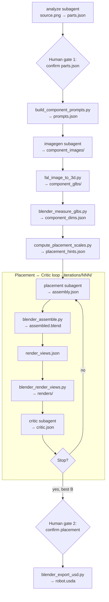

# Pipeline Run

This page is the end-to-end guide for running Dexter. It covers the agentic loop, the output directory layout, how to start a run, and a detailed walkthrough of a real **dishwasher** run (`.intermediate/dishwasher/001/`).

## The agentic loop

Dexter has no standalone Python driver. The **orchestrator** OpenCode agent sequences four subagents and deterministic tool scripts, pausing at two human gates.



| Gate | When | What you review |
|------|------|-----------------|
| **Human gate 1** | After `parts.json` | Part names, descriptions, joint types, geometry hints |
| **Human gate 2** | After placement loop | Best iteration renders, critic score, `assembled.blend` |

The orchestrator **resumes from disk**: if an artifact already exists and validates, that step is skipped unless you ask to redo it.

Loop exit (from `config.yaml`): stop when `score >= score_threshold` and `N >= min_loops`, when `N >= max_loops`, or when the score has not improved for `no_improvement_patience` consecutive iterations. The best-scoring iteration is kept even if a later one regresses.

See [Agentic Loop](/architecture/agentic-loop) for full stage semantics.

---

## Output directory structure

Every run writes to `.intermediate/<asset>/<NNN>/`. The tree is gitignored and is the single source of truth for run state.

### Run root layout

```
.intermediate/<asset>/<NNN>/
│
├── source.png                         # copied input image
│
├── parts.json                         # Parts IR (analyze agent)
├── prompts.json                       # per-part image prompts
├── component_dims.json                # raw GLB bounding boxes
├── placement_hints.json               # pre-computed scales and poses
├── placement.confirmed                # human-approved iteration id (e.g. "006")
│
├── build_component_prompts.json       # orchestrator-written config
├── openai_imagegen.json               # orchestrator-written config
├── fal_image_to_3d.json               # orchestrator-written config
│
├── component_images/                  # isolated component PNGs
│   ├── dishwasher_cabinet.png
│   ├── front_door.png
│   ├── upper_dish_rack.png
│   └── lower_dish_rack.png
│
├── component_glbs/                    # 3D meshes from fal.ai
│   ├── dishwasher_cabinet.glb
│   ├── front_door.glb
│   ├── upper_dish_rack.glb
│   └── lower_dish_rack.glb
│
├── iterations/
│   ├── 001/
│   │   ├── assembly.json              # Layout IR
│   │   ├── assembled.blend            # Blender scene
│   │   ├── render_views.json          # camera plan (orchestrator)
│   │   ├── renders/                   # front, top, left, isometric PNGs
│   │   └── critic.json                # Critique IR
│   ├── 002/ … 006/
│   └── <best B>/
│
├── robot.usda                         # final USD deliverable
├── robot_prim_map.json                # Blender name → USD prim path
└── textures/                          # material images for Isaac Sim
```

### Naming conventions

| Pattern | Example | Meaning |
|---------|---------|---------|
| `<asset>` | `dishwasher` | Object name from `parts.json` → `object` field |
| `<NNN>` | `001` | Zero-padded run number, auto-incremented |
| Part stems | `front_door` | Used for PNG, GLB, and assembly link names |
| Iteration dirs | `001` … `006` | One placement ↔ critic round each |

### Artifact lifecycle

| Artifact | Produced in step | Consumed by |
|----------|-------------------|-------------|
| `source.png` | Run start (copy) | analyze, imagegen |
| `parts.json` | Step 1 | prompts, placement hints, placement |
| `prompts.json` | Step 2 | imagegen |
| `component_images/` | Step 3 | fal_image_to_3d |
| `component_glbs/` | Step 4 | blender_measure_glbs |
| `component_dims.json` | Step 5 | placement hints, placement, critic |
| `placement_hints.json` | Step 6 | placement (iteration 1) |
| `iterations/N/assembly.json` | Step 7 (each loop) | blender_assemble, critic |
| `iterations/N/assembled.blend` | Step 7 | blender_render_views, USD export |
| `iterations/N/renders/` | Step 7 | critic |
| `iterations/N/critic.json` | Step 7 | placement (iteration 2+) |
| `placement.confirmed` | Human gate 2 | USD export |
| `robot.usda` | Step 8 | Isaac Sim |

---

## Starting a run

### CLI (headless)

```bash
opencode run --agent orchestrator -- "build the dishwasher from input_images/dishwasher.png"
```

### TUI (interactive)

```bash
cd /path/to/dexter
opencode
```

Press **Tab** or type `/agents` and select **orchestrator**:


Useful slash commands:

| Command | Purpose |
|---------|---------|
| `/agents` | Switch to `orchestrator` |
| `/connect` | Re-authenticate model provider |
| `/init` | Guided `AGENTS.md` setup |
| `/new` | New session |


Then type your task, for example:

```
build the dishwasher from input_images/dishwasher.png
```

### Resume or iterate

```bash
# Resume interrupted run
opencode run --agent orchestrator -- "resume .intermediate/dishwasher/001/"

# Continue after human parts gate
opencode run --agent orchestrator -- "parts confirmed, continue .intermediate/dishwasher/001/"

# Request more placement iterations
opencode run --agent orchestrator -- "run 3 more placement iterations for .intermediate/dishwasher/001/"
```

### Monitor progress

```bash
RUN=.intermediate/dishwasher/001

ls $RUN/parts.json $RUN/component_glbs/ $RUN/placement_hints.json
ls $RUN/iterations/

# Latest critic score
cat $RUN/iterations/005/critic.json | python3 -c \
  "import json,sys; d=json.load(sys.stdin); print(f'Iter {d[\"iteration\"]}: {d[\"score\"]} — {d[\"summary\"]}')"

cat $RUN/placement.confirmed 2>/dev/null || echo "Placement not yet approved"
ls $RUN/robot.usda 2>/dev/null || echo "USD not yet exported"
```

---

## Walkthrough: dishwasher run

The following traces `.intermediate/dishwasher/001/` — a real run on `input_images/dishwasher.png`. Four parts were identified: **dishwasher_cabinet**, **front_door**, **upper_dish_rack**, **lower_dish_rack**.

The detailed steps below map to the [six pipeline stages](/architecture/agentic-loop#six-pipeline-stages):

| Stage | What happens | Walkthrough steps |
|-------|--------------|-------------------|
| **1 — Parts** | Analyze agent lists moving parts; you review | Step 1 |
| **2 — Images** | Prompts built; one PNG per part | Steps 2–3 |
| **3 — Meshes** | PNGs → GLBs; sizes measured; hints computed | Steps 4–6 |
| **4 — Layout** | Placement agent writes positions and scales | Step 7 (each round) |
| **5 — Refine** | Renders compared; critic suggests fixes; loop repeats | Steps 7–8 |
| **6 — Export** | Approved blend → USD for Isaac Sim | Step 9 |

### Step 1 — Part identification (analyze agent)

The analyze agent reads your photo and proposes which parts the dishwasher is made of. It writes `parts.json` with names, descriptions, joints, and geometry hints. The orchestrator stops here so you can check the list before spending API credits on 3D generation.

**Who:** `analyze` subagent  
**Human gate:** Yes — review before any 3D generation  
**Outputs:**

| File | Description |
|------|-------------|
| `source.png` | Copy of `input_images/dishwasher.png` |
| `parts.json` | Parts IR — kinematic tree and geometry hints |


The analyze agent proposed:

| Part | `joint_type` | Parent | Key fields |
|------|-------------|--------|------------|
| `dishwasher_cabinet` | `fixed` | — (root) | Main wash chamber |
| `front_door` | `revolute` | cabinet | `hinge_side: bottom` |
| `upper_dish_rack` | `prismatic` | cabinet | `slide_axis: -y` |
| `lower_dish_rack` | `prismatic` | cabinet | `slide_axis: -y` |

Example excerpt from `parts.json`:

```json
{
  "name": "front_door",
  "description": "The drop-down front door at the lower front of the dishwasher.",
  "parent": "dishwasher_cabinet",
  "joint_type": "revolute",
  "size_fraction": [1.0, 0.08, 0.72],
  "position_in_parent": "center",
  "hinge_side": "bottom"
}
```

**What to check at human gate 1:** specific part names (not `body` or `part_1`), accurate descriptions, plausible `size_fraction` and `hinge_side` / `slide_axis`.

---

### Step 2 — Build prompts (tool script)

After you approve the parts, this script turns each part's description into an image prompt. The prompts ask for that part alone on a white background, which makes the next step easier for the image model.

**Who:** orchestrator → `build_component_prompts.py`  
**Outputs:**

| File | Description |
|------|-------------|
| `build_component_prompts.json` | Orchestrator-written config |
| `prompts.json` | One image-generation prompt per part |

Each prompt tells the model to isolate one part from `source.png` on a white background. Descriptions from `parts.json` are copied into the prompts.

---

### Step 3 — Component images (imagegen agent)

The imagegen agent runs OpenAI once per part. Each call uses `source.png` as reference so the isolated images still look like the same product. You get one PNG per part in `component_images/`.

**Who:** `imagegen` subagent → `openai_imagegen.py`  
**Requires:** `OPENAI_API_KEY`  
**Outputs:**

| File | Description |
|------|-------------|
| `openai_imagegen.json` | Orchestrator-written config |
| `component_images/<part>.png` | One isolated PNG per part |


| Part | File |
|------|------|
| Cabinet | `component_images/dishwasher_cabinet.png` |
| Front door | `component_images/front_door.png` |
| Upper rack | `component_images/upper_dish_rack.png` |
| Lower rack | `component_images/lower_dish_rack.png` |

Uses OpenAI `images.edit()` with `source.png` attached as visual reference for every call.

---

### Step 4 — Image-to-3D meshes (tool script)

Each component PNG is sent to fal.ai and comes back as a 3D mesh. The meshes are rough but good enough for layout and rendering. One GLB is saved per part.

**Who:** orchestrator → `fal_image_to_3d.py`  
**Requires:** `FAL_KEY`  
**Outputs:**

| File | Description |
|------|-------------|
| `fal_image_to_3d.json` | Orchestrator-written config |
| `component_glbs/<part>.glb` | One GLB mesh per part |

<video controls width="100%">
  <source src="/assets/video/dexter/component_glbs.mp4" type="video/mp4" />
</video>

*Per-part meshes after fal.ai Hunyuan 3D conversion.*

The script skips any image that already has a matching `.glb`, so re-running only fills in missing meshes.

---

### Step 5 — Measure GLBs (Blender script)

Blender opens each downloaded mesh and records its bounding box. These raw sizes tell the placement agents how big each GLB is before any scaling is applied.

**Who:** orchestrator → `blender_measure_glbs.py`  
**Outputs:**

| File | Description |
|------|-------------|
| `component_dims.json` | Raw bounding box per GLB (`size`, `center`, `min`, `max`) |

These are **raw** sizes before any `scale` from `assembly.json`. The placement and critic agents use them to compute world-space dimensions.

---

### Step 6 — Placement hints (tool script)

This script combines part geometry from `parts.json` with measured mesh sizes to suggest scales and poses for the first layout. The orchestrator passes real-world cabinet dimensions so the dishwasher ends up roughly the right size in metres.

**Who:** orchestrator → `compute_placement_scales.py`  
**Mandatory** before the first placement iteration.  
**Outputs:**

| File | Description |
|------|-------------|
| `placement_hints.json` | `root_scale`, per-part `child_scale`, closed/open poses |

The orchestrator estimated real-world dims `0.60 × 0.60 × 0.85` m for the dishwasher cabinet and passed `--open-angle-deg 90` for the drop-down door. All values are derived from `parts.json` geometry fields — not guessed by the placement agent.

---

### Step 7 — Placement ↔ critic loop

This is stages 4 and 5 together. Placement writes where each mesh goes. Blender assembles the scene and renders four views. The critic scores the result against the source photo and suggests fixes. Placement runs again with those fixes until the loop stops. The orchestrator keeps the best-scoring iteration.

**Who:** `placement` + `critic` subagents; `blender_assemble.py`, `blender_render_views.py`  
**Outputs per iteration** (`iterations/NNN/`):

| File | Description |
|------|-------------|
| `assembly.json` | Layout IR — position, orientation, scale per link |
| `assembled.blend` | Blender scene |
| `render_views.json` | Four auto-framed cameras (orchestrator-written) |
| `renders/front.png` | Front diagnostic view |
| `renders/top.png` | Top view — door angles, X/Y alignment |
| `renders/left.png` | Left view — depth, rack pull-out |
| `renders/isometric.png` | Overall shape |
| `critic.json` | Score (0–100) and per-component fixes |

#### Iteration 1 — score 72

First placement using `placement_hints.json`. Cabinet and door were reasonable; both racks were **offset laterally** and protruded through the side walls.


Critic summary: *"Dishwasher body and door are close, but both racks are laterally offset and visibly protrude through the side walls."*

| Component | Critic action |
|-----------|--------------|
| `dishwasher_cabinet` | `locked: true` |
| `front_door` | `locked: true` |
| `upper_dish_rack` | `suggested_delta` — shift left in parent space |
| `lower_dish_rack` | `suggested_delta` — shift right in parent space |

#### Iteration 5 — score 84

After four more rounds, cabinet, door, and lower rack were locked. Only the upper rack pull-out distance still needed a small adjustment.


Critic summary: *"Recognisable open dishwasher; cabinet, door, and lower rack are good, but the upper rack is pulled too far forward from the cavity."*

#### Iteration 6 — score 86 (best in this run)

Placement applied the critic's upper-rack correction from iteration 5. The rack sits further back in the cavity, matching the source photo more closely. Cabinet, door, and lower rack stayed locked.


| Iteration | Score | Main issue |
|-----------|-------|------------|
| 001 | 72 | Racks offset through side walls |
| 002 | 84 | Minor rack depth |
| 003 | 78 | Door position regression |
| 004 | 78 | Door slab shifted |
| 005 | 84 | Upper rack over-pulled |
| 006 | 86 | Best layout — rack pull-out corrected |

The orchestrator tracks the **best** iteration by score. Iteration 6 scored highest at **86**, so that layout was kept for approval and export.

**Iteration 2+ behavior:** placement receives the previous best `assembly.json` + `critic.json` and applies only the critic's corrections. Components marked `locked: true` are not changed.

---

### Step 8 — Human gate 2 (placement approval)

The loop has finished. You review the best iteration's renders and decide whether to approve, pick a different iteration, or ask for more rounds. Approval is recorded in `placement.confirmed`.

**Who:** you  
**Output:**

| File | Description |
|------|-------------|
| `placement.confirmed` | Single line: approved iteration id, e.g. `006` |

Review the best iteration's `renders/`, `critic.json`, and open `assembled.blend` in Blender if needed. Tell the orchestrator to approve, pick a different iteration, or request more placement rounds.

---

### Step 9 — USD export (tool script)

With placement approved, Blender exports the scene to USD. Textures are extracted alongside the file so Isaac Sim can load materials correctly. This is the final deliverable.

**Who:** orchestrator → `blender_export_usd.py`  
**Requires:** `placement.confirmed`  
**Outputs:**

| File | Description |
|------|-------------|
| `robot.usda` | Geometry + materials, Z-up, metres |
| `robot_prim_map.json` | Blender object name → USD prim path |
| `textures/` | Extracted material images |

```bash
blender --background --python tool_scripts/blender_export_usd.py -- \
  --blend .intermediate/dishwasher/001/iterations/006/assembled.blend \
  --output .intermediate/dishwasher/001/robot.usda \
  --root-prim-path /World/Robot
```

<video controls width="100%">
  <source src="/assets/video/dexter/dishwasher_blender_animation.mp4" type="video/mp4" />
</video>

*Final assembly in Blender with door and racks on their joints.*

---

## Validate artifacts

```bash
python3 tool_scripts/validate_json.py \
  --schema schemas/parts.schema.json \
  --data .intermediate/dishwasher/001/parts.json

python3 tool_scripts/validate_json.py \
  --schema schemas/assembly.schema.json \
  --data .intermediate/dishwasher/001/iterations/006/assembly.json
```

---

## Troubleshooting

See [Troubleshooting](/sample-runs/troubleshooting) for common failures (API keys, fal credits, placement not converging, schema errors, resume semantics).
