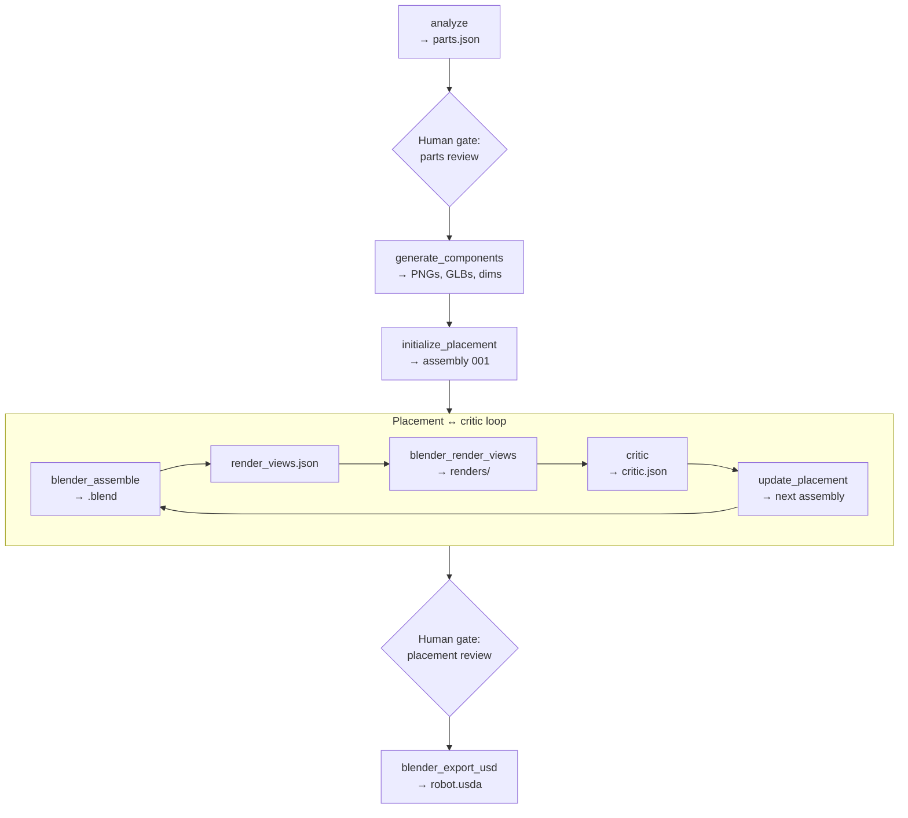

# Sample Run: Dishwasher

This page walks through one full run on `input_images/dishwasher.png` → `.intermediate/dishwasher/001/`. It explains what each agent and tool does, what it reads and writes, and how the files appear on disk.

For how to start or resume a run, see [Pipeline Run](/getting-started/pipeline-run).

## Overview



Four parts were identified: `dishwasher_cabinet`, `front_door`, `upper_dish_rack`, `lower_dish_rack`.

---

## Agents

Agents handle judgment. Subagents each write one JSON file; the orchestrator sequences everything else.

### Orchestrator

You interact with the orchestrator only. It lists the run directory before each step, invokes subagents, runs tool scripts, writes `render_views.json` each iteration, tracks the best critic score, and pauses at two human gates.

| Role | Details |
|------|---------|
| **Reads** | `configs/base.yaml`, existing run artifacts |
| **Writes** | `render_views.json` per iteration; copies `source.png` at run start |
| **Decides** | Which step to run next, loop exit, best iteration `B` |

### analyze

| | |
|---|---|
| **Input** | `source.png` |
| **Output** | `parts.json` |
| **Validates** | `schemas/parts.schema.json` |

**Logic:** Decomposes the photo into named moving parts. Each entry gets a description (used in image prompts), parent part name, joint type, and numeric placement: `world_size`, `world_center`, and `euler_deg` (the pose shown in the source image).

**In this run:** Cabinet (fixed root, ~0.60 × 0.60 × 0.85 m), front door (revolute, closed), two racks (fixed inside cavity, closed).

```json
{
  "name": "front_door",
  "description": "The drop-down front door at the lower front of the dishwasher.",
  "parent": "dishwasher_cabinet",
  "joint_type": "revolute",
  "world_size": [0.60, 0.04, 0.51],
  "world_center": [0, -0.28, 0.255],
  "euler_deg": [0, 0, 0]
}
```


The orchestrator stops here until you confirm names, joint types, and placement numbers.

### critic

| | |
|---|---|
| **Input** | `source.png`, four renders, `assembly.json` |
| **Output** | `critic.json` |
| **Validates** | `schemas/critic.schema.json` |

**Logic:** Compares renders to the source photo. For each part it judges scale (`world_size`), position (`world_center`), and orientation (`euler_deg`) independently. Correct parts get `locked: true`. Others get `corrected_world_size`, `corrected_world_center`, and/or `suggested_rotation_delta`. Visible overlap is penalized; scale and position errors weigh equally.

**In this run (iteration 1, score 72):** Cabinet and door were fine. Both racks were shifted sideways and clipped through the side walls — critic returned `corrected_world_center` for each. After five more rounds, iteration 6 reached score 86.

---

## Tools — one-time setup

### generate_components.py

| | |
|---|---|
| **Input** | `parts.json`, `source.png`, `configs/base.yaml` |
| **Output** | `component_images/<part>.png`, `component_glbs/<part>.glb`, `component_dims.json` |
| **Requires** | `OPENAI_API_KEY`, `FAL_KEY`, Blender |

**Logic:** For each part, builds an image prompt from the description, calls OpenAI image edit with `source.png` as reference to produce an isolated PNG, sends that PNG to fal.ai for a GLB mesh, then measures each GLB's raw bounding box via `blender_measure_glbs.py`. Skips parts whose outputs already exist; skips the whole step if `component_dims.json` exists.

**In this run:** Four PNGs and four GLBs. Raw mesh sizes in `component_dims.json` are pre-scale (e.g. a door GLB might be 0.93 m wide even though the real door is 0.60 m).


<video controls width="100%">
  <source src="/assets/video/dexter/component_glbs.mp4" type="video/mp4" />
</video>

### initialize_placement.py

| | |
|---|---|
| **Input** | `parts.json`, `component_dims.json`, `configs/base.yaml` |
| **Output** | `placement_init.json`, `iterations/001/assembly.json` |
| **Validates** | `schemas/placement_init.schema.json`, `schemas/assembly.schema.json` |

**Logic:** Reads world-space `world_size`, `world_center`, and `euler_deg` from `parts.json`, then combines them with raw mesh sizes from `component_dims.json` to compute Blender `node_scale` and `node_origin`. Fully deterministic — no LLM. Validates both output files against their schemas.

**In this run:** Cabinet at origin with correct metre scale. Door and racks placed at the closed poses from `parts.json`.

---

## Tools — placement loop

Each iteration lives in `iterations/NNN/`. Iteration 001's `assembly.json` comes from `initialize_placement.py`; later ones from `update_placement.py`.

### blender_assemble.py

| | |
|---|---|
| **Input** | `assembly.json` (loads `component_dims.json` via the `root` path inside it) |
| **Output** | `assembled.blend` |

**Logic:** Imports each part's GLB, parents parts in the kinematic tree, and positions each mesh so its world bounding box matches the part's `world_size`, `world_center`, and `euler_deg`. Raw GLB dimensions are used internally to derive Blender scale and pivot.

### render_views.json (orchestrator)

| | |
|---|---|
| **Input** | `configs/base.yaml` `render` defaults |
| **Output** | `iterations/NNN/render_views.json` |
| **Validates** | `schemas/render_views.schema.json` |

**Logic:** Four auto-framed cameras (`front`, `top`, `left`, `isometric`) with direction vectors and lighting. Written by the orchestrator each iteration.

### blender_render_views.py

| | |
|---|---|
| **Input** | `assembled.blend`, `render_views.json` |
| **Output** | `iterations/NNN/renders/*.png` |

**Logic:** Renders one PNG per camera. These images are what the critic compares against the source photo.

### update_placement.py (iteration 2+)

| | |
|---|---|
| **Input** | Previous `assembly.json`, previous `critic.json` |
| **Output** | Next `assembly.json` (validated against `schemas/assembly.schema.json`) |

**Logic:** Copies the previous layout and applies critic corrections directly:

- `corrected_world_size` → replaces `world_size`
- `corrected_world_center` → replaces `world_center`
- `suggested_rotation_delta` → added to `euler_deg`
- `locked: true` or no entry → unchanged

After a score regression the orchestrator can pass the best-scoring layout as `--prev-assembly` instead of the most recent one.

---

## Iteration results (this run)

### Iteration 1 — score 72

First layout from `initialize_placement.py`. Cabinet and door were reasonable; both racks were offset laterally and protruded through the side walls.


| Component | Critic action |
|-----------|--------------|
| `dishwasher_cabinet` | `locked: true` |
| `front_door` | `locked: true` |
| `upper_dish_rack` | `corrected_world_center` |
| `lower_dish_rack` | `corrected_world_center` |

### Iteration 6 — score 86 (best)

| Iteration | Score | Main issue |
|-----------|-------|------------|
| 001 | 72 | Racks offset through side walls |
| 002 | 84 | Minor rack depth |
| 003 | 78 | Door position regression |
| 004 | 78 | Door slab shifted |
| 005 | 84 | Upper rack over-pulled |
| 006 | 86 | Best layout |


The orchestrator kept iteration 6 (highest score) for placement review and export.

---

## Tools — export

### blender_export_usd.py

| | |
|---|---|
| **Input** | Approved `iterations/<B>/assembled.blend`, `configs/base.yaml` `usd.root_prim_path` |
| **Output** | `robot.usda`, `robot_prim_map.json`, `textures/` |

**Logic:** Exports the Blender scene to USD with Z-up orientation for Isaac Sim. Embedded textures are extracted to `textures/`. Runs only after you approve a layout at the placement gate.

<video controls width="100%">
  <source src="/assets/video/dexter/dishwasher_blender_animation.mp4" type="video/mp4" />
</video>

---

## How the pieces connect

| Step | Actor | Reads | Writes |
|------|-------|-------|--------|
| 1 | analyze | `source.png` | `parts.json` |
| 2 | generate_components | `parts.json`, `source.png` | `component_images/`, `component_glbs/`, `component_dims.json` |
| 3 | initialize_placement | `parts.json`, `component_dims.json` | `placement_init.json`, `iterations/001/assembly.json` |
| 4a | blender_assemble | `assembly.json` | `assembled.blend` |
| 4b | orchestrator | `configs/base.yaml` | `render_views.json` |
| 4c | blender_render_views | `assembled.blend`, `render_views.json` | `renders/` |
| 4d | critic | `source.png`, `renders/`, `assembly.json` | `critic.json` |
| 4e | update_placement | prior `assembly.json`, `critic.json` | next `assembly.json` |
| 5 | blender_export_usd | approved `assembled.blend` | `robot.usda`, `textures/` |

Steps 4a–4e repeat until the loop exits. Step 4e is skipped for iteration 001.

See [Agents](/architecture/agents), [Tool Scripts](/architecture/tools), and [Intermediate Representation](/architecture/intermediate-representation) for field-level detail.
