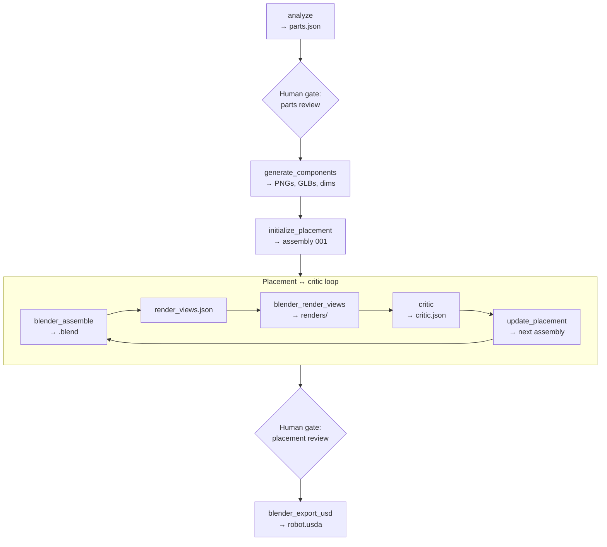

# Sample Run: Dishwasher

This page follows one run from `input_images/dishwasher.png` to `.intermediate/dishwasher/001/`. Steps appear in the order the orchestrator runs them. For how to start or resume, see [Installation & Run](/getting-started/installation).

Download the real run artifacts (and outputs for other example assets) from [varmology/dexter-sample-outputs](https://huggingface.co/datasets/varmology/dexter-sample-outputs) on Hugging Face — useful if you want to verify outputs without running the full pipeline.



The run identified four parts: `dishwasher_cabinet`, `front_door`, `upper_dish_rack`, and `lower_dish_rack`.

## Start the run

You prompt the orchestrator in OpenCode. It copies the input image to `source.png` under `.intermediate/dishwasher/001/` and checks which files already exist before each step.

## Analyze subagent

The analyze subagent reads `source.png` and writes `parts.json`. Each entry has a name, description, parent part, joint type, and size and pose in metres.

| | |
|---|---|
| **Input** | `source.png` |
| **Output** | `parts.json` |

In this run the cabinet is the fixed root (~0.60 × 0.60 × 0.85 m). The front door is revolute and closed. Both racks are fixed inside the cavity.

```json
{
  "name": "front_door",
  "description": "The drop-down front door at the lower front of the dishwasher.",
  "parent": "dishwasher_cabinet",
  "joint_type": "revolute",
  "world_size": [0.60, 0.04, 0.51],
  "world_center": [0, -0.28, 0.255],
  "euler_deg": [0, 0, 0]
}
```


## Parts review

The orchestrator pauses. You confirm part names, joint types, and placement numbers before any 3D generation runs.

## Component generation

This script runs once after parts approval. For each part it builds an image prompt from the description, calls OpenAI to produce an isolated PNG (using `source.png` as reference), sends the PNG to fal.ai for a GLB, and measures raw mesh bounds with Blender.

| | |
|---|---|
| **Input** | `parts.json`, `source.png` |
| **Output** | `component_images/`, `component_glbs/`, `component_dims.json` |

Four PNGs and four GLBs were written. Raw sizes in `component_dims.json` are pre-scale. A door GLB might measure 0.93 m wide while the target door width is 0.60 m. Placement steps correct that later.


<video controls width="100%">
  <source src="/assets/video/dexter/component_glbs.mp4" type="video/mp4" />
</video>

## Initial placement

This script reads poses from `parts.json` and raw mesh sizes from `component_dims.json`, computes Blender `node_scale` and `node_origin`, and writes `iterations/001/assembly.json`. No subagent is involved.

| | |
|---|---|
| **Input** | `parts.json`, `component_dims.json` |
| **Output** | `iterations/001/assembly.json` |

The cabinet sits at the origin at metre scale. The door and racks use the closed poses from `parts.json`.

## Placement loop

Each round lives in `iterations/NNN/`. Iteration 001 uses the assembly from step 5. Later iterations start with `update_placement.py`, which applies the previous `critic.json` to produce the next `assembly.json`.

### Assemble scene

Loads each GLB, parents parts in the kinematic tree, and applies the pre-computed `node_scale`, `node_origin`, and `euler_deg` from `assembly.json`.

| | |
|---|---|
| **Input** | `assembly.json` |
| **Output** | `assembled.blend` |

### Render view configuration

The orchestrator writes four camera definitions (front, top, left, isometric) from `configs/base.yaml` render defaults.

| | |
|---|---|
| **Output** | `iterations/NNN/render_views.json` |

### Render views

Renders one PNG per camera from the assembled scene.

| | |
|---|---|
| **Input** | `assembled.blend`, `render_views.json` |
| **Output** | `renders/*.png` |

### Critic evaluation

The critic subagent receives `source.png`, the four renders, and `assembly.json`. It writes `critic.json` with a score and per-part corrections. Correct parts are marked `locked`. Others may get `corrected_world_size`, `corrected_world_center`, or `suggested_rotation_delta`.

| | |
|---|---|
| **Input** | `source.png`, `renders/`, `assembly.json` |
| **Output** | `critic.json` |

### Iteration 1 (score 72)

The first layout came from `initialize_placement.py`. The cabinet and door were acceptable. Both racks were offset sideways and clipped through the side walls.


| Component | Critic action |
|-----------|--------------|
| `dishwasher_cabinet` | `locked: true` |
| `front_door` | `locked: true` |
| `upper_dish_rack` | `corrected_world_center` |
| `lower_dish_rack` | `corrected_world_center` |

### Update placement

Copies the previous layout and applies critic corrections. Locked parts and parts with no issue entry are unchanged. If a round scores lower than the best so far, the orchestrator can base the next assembly on the best prior layout instead of the most recent one.

The loop ran six times. Iteration 6 scored highest at 86.

| Iteration | Score | Main issue |
|-----------|-------|------------|
| 001 | 72 | Racks offset through side walls |
| 002 | 84 | Minor rack depth |
| 003 | 78 | Door position regression |
| 004 | 78 | Door slab shifted |
| 005 | 84 | Upper rack over-pulled |
| 006 | 86 | Best layout |


The orchestrator selected iteration 6 for placement review.

## Placement review

You review renders from the best iteration, the critic score, and `assembled.blend`. The orchestrator waits for approval before export.

## USD export

Exports the approved `assembled.blend` to `robot.usda`, writes `robot_prim_map.json`, and extracts textures to `textures/`.

| | |
|---|---|
| **Input** | `iterations/006/assembled.blend` |
| **Output** | `robot.usda`, `robot_prim_map.json`, `textures/` |

<video controls width="100%">
  <source src="/assets/video/dexter/dishwasher_blender_animation.mp4" type="video/mp4" />
</video>

For schema fields, agent permissions, and script flags, see [Agentic Loop](/architecture/agentic-loop).
